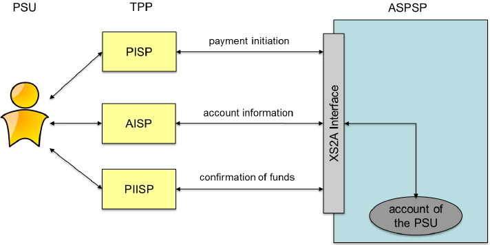

---
title: "ÍST TS 310:2020"
author: ICS. 3.060
date: "Gildistaka: 22.02.2022"
subject: "Icelandic Online Banking Webservices "
keywords: [IOBWS, ÍST, TS, 310]
subtitle: ["Tækniforskrift - Innlendar greiðslur og innlán", "Technical Specification - Domestic payments and deposits"]
lang: "en"
titlepage: true,
# titlepage-rule-color: "360049"
titlepage-rule-height: 0
titlepage-background: "lib/istfrontpage.pdf"
toc: true
toc-title: Table of contents
# toc-own-page: true
book: true
classoption: oneside
numbersections: true
first-chapter: 1
listings-no-page-break: false
highlight: "zenburn"
include-before: |
  Participants in ÍST Workshop VS-3 Innlendar greiðslur og innlán (e.
  Domestic payments and deposits) and participants in working groups preparing the workshop agreement.

    -----------------------------------------------------------------------------------
    Name                  Company / \                 Name               Company / \                 
                          organisation / \                               organisation / \             
                          association                                    association                
    -------------------- ---------------------------- ------------------ --------------
    Árni Björnsson       Samband sparisjóða á Íslandi Ingibergur S.      Unimaze
                                                      Stefnisson         
    Arnar Freyr          Íslandsbanki                 Íris Dögg          Kvika
    Björnsson                                         Kristmundsdóttir   

    Ásgeir Helgi         Atlas lögmenn                Jóhannes Þór       Íslandsbanki
    Jóhannsson                                        Ágústarson         

    Ásgeir Örn           Samtök                       Jóhann             Landsbankinn
    Ásgeirsson           fjártæknifyrirtækja/Meniga   Þorvarðarson       

    Atli Mar Gunnarsson  Arion banki                  Jökull Huxley      Landsbankinn
                                                      Yngvason           

    Bjarki Jóhannsson    Creditinfo                   Kjartan Ásþórsson  Kvika

    Bjarni Þór Pálsson   RB                           Kristinn           Arion banki
                                                      Stefánsson         

    Björn Ingi Björnsson Arion banki                  Markús Guðmundsson Sendill

    Bragi Þór            RB                           Ólafur Bergsson    Íslandsbanki
    Guðmundsson                                                          

    Daníel Snorrason     Seðlabanki Íslands           Ólafur Eiríksson   Landsbankinn

    Einar Eiríksson      Origo                        Páll Arnar         Creditinfo
                                                      Guðmundsson        

    Elfa D.              Arion banki                  Sigrún             WISE
    Marteinsdóttir                                    Gunnarsdóttir      

    Gísli Konráð         Landsbankinn                 Sigurbjörn         TCM innheimta
    Björnsson                                         Þorbjörnsson       

    Guðjón Karl Arnarson RB                           Sigurður Gauti     Alskil
                                                      Hauksson           

    Guðmundur Jón        DataPlato ehf                Sigurjón Örn       Valitor
    Halldórsson                                       Kárason            

    Gunnar Stefánsson    Arion banki                  Snorri Karlsson    Íslandsbanki

    Halla Árnadóttir     RB                           Snorri Jónsson     Íslandsbanki

    Halldór Vagn         Landsbankinn                 Stefán Orri        Íslandsbanki
    Hreinsson                                         Stefánsson         

    Halldóra G.          Landsbankinn                 Styrmir            Sjálfstæður
    Steindórsdóttir                                   Kristjánsson       

    Helena Pálsdóttir    FME                          Sveinn G.          Landsbankinn
                                                      Gunnarsson         

    Helena Rúriksdóttir  Arion banki                  Þorsteinn          Wise
                                                      Guðmundsson        

    Hermann Snorrason    Landsbankinn                 Þorsteinn Lemke    Uniconta

    Hjálmar Brynjólfsson FME                          Védís              Arion banki
                                                      Ingólfsdóttir      

    Hrannar Már          Arion banki                  Védís              Landsbankinn
    Hallkelsson                                       Sigurðardóttir     

    Ingibjartur Jónsson  Valitor                      Ingvi Rafn         Íslandsbanki
                                                      Guðmundsson        

    Ingvaldur Einarsson  Uniconta                                        
    -----------------------------------------------------------------------------------

    ©Icelandic Standards (IST) 2020, 2022. All Rights Reserved.
   
    Without the written permission of the publisher, this workshop
    agreement may not be reprinted or reproduced in any form by any means,
    mechanical or electronic, such as by photocopying, sound recording or
    other means, currently known or later invented, nor may the agreement
    be disseminated through an electronic database.
   
    1\. edition

  # Foreword

  TODO
  [] Finalize the final of participants @gudval
  [] Update final dates in foreword

  This ÍST Technical Specification was developed in accordance with "ÍST
  Reglur um tækniforskriftir, tækniskýrslur og vinnustofusamþykktir" (*e.*
  IST rules on Technical Specifications, Technical Reports and Workshop
  Agreements). The TS (Technical specification) was prepared by the
  technical committee TN-FMÞ (The Technical Committee on Financial 
  Services) that operates within FUT (Sector committee for ICT
  standardisation) following a public call for participation within
  TN-FMÞ. The final draft was sent to the TN-FMÞ on the 2022-01-XX and
  approved by correspondence on the 2022-XX-XX.
  The text of ÍST TS-310 was submitted to IST for publication on 2022-02-XX.
 
  The ÍST TS was primarly funded by Íslandsbanki, Arion Banki and 
  Landsbankinn. 
  
  This ÍST TS is the result the workgroup TN-FMÞ-VH-8.
  It parts it is based on the WA-310 workshop agreement 
  that resulted from previous work by TN-FMÞ-VH-1 on Technical requirements 
  and TN-FMÞ-VH-2 on Business requirements, and which was approved within TN-FMÞ 
  on the 2019-12-12. TS 310 should, however, not be viewed as a succesor to, even
  directly related to that agreement, which focused on laying groundwork for PSD2
  compliance.

  ÍST TS-310 is not subject to any patent rights. It is based on the Berlin Group's
  NextGenPSD2 XS2A Framework, which is distributed under a Creative Commons
  Attribution 4.0 International Public License (CC BY).

  This means that the underlying Specification for ÍST TS-310 can be copied and redistributed in any
  medium or format for any purpose, even commercially, and when shared,
  that appropriate credit must be given, a link to the license must be
  provided, and indicated if changes were made. You may do so in any
  reasonable manner, but not in any way that suggests the licensor
  endorses you or your use. In addition, if you remix, transform, or build
  upon the Specification, you may not distribute the modified
  Specification.

  The Technical Committee's participants have made every effort to ensure
  the reliability and accuracy of the technical and non-technical content
  of ÍST TS-310, but this does not guarantee, either explicitly or
  implicitly, its correctness. Users of ÍST TS-310 should be aware that
  neither the TN-FMÞ, nor IST can be held liable for damages or losses of
  any kind whatsoever which may arise from its application. Users of ÍST
  TS-310 do so on their own responsibility and at their own risk.

# Introduction {.unnumbered}

This Technical Specification (TS) present version 3.0 of the Icelandic 
Online Banking Services (IOBWS), for domestic payments and deposits. Related
TS documents will address other parts of the IOBWS, as upgradess or new functionality
to the common service interfaces offered by those Icelandic banks that choose to implement each
specifications.

Previous versions of IOBWS, released
in 2007 and 2013 respectively, used the most recent OASIS SOAP
standards at the time, to define common web service interfaces for  
for the Icelandic market. This enabled software vendors, enterprises
and service providers to integrate their accounting, payment, and information
systems with the commercial and savings banks, to act on behalf of the
customers and with full access to their data.

Iceland, with its homogeneous financial landscape, has enjoyed instant
credit transfers between all the banks since 1987, with real-time gross
settlements, and other universally accepted services such as the common collection 
solution (Kröfupotturinn) for issuing and paying claims. All this functionality
was expected and has been available through IOBWS v1 and v2, comparable to 
the functionality enjoyed by users of the online banking Web UIs.

When initiating work on the previous versions, the participants in
the TN-FMÞ started out with reviewing existing or emerging specifications 
in the global or mostly European financial industry. None were deemed a 
good fit at the time for local adaptation, as they reflected inherent the legacy
in inter-bank communications outside Iceland, even in the case of other 
Nordic countries.

Meanwhile, the broader market and new technology standards in Europe been catching up. 
The Open Banking regulation in UK and the PSD2 regulation issued by the European Parliment
gave rise to initiatives to standardize access to payment functionality and 
account information, on behalf of customers by third parties. One such effort, the 
NextGenPSD2 Framework developed by the Berlin Group, has met a broad acceptance in the EEA. 
The data model references ISO 20022, and close enough to how the Icelandic market has evolved as to
make it a relatively straightforward to adapt IOBWS to use it as a base, instead of maintaining 
an independant linage of API specifications. 

Another goal with v3 that is achieved in adopting the NextGenPSD2 Framework, is moving to
a REST like API defined by a recent version of the Open API Specification, and more
open authentication and authorization standards than supported by previous incarnations
of IOBWS.

# Scope 

The Icelandic banks joint effort to create third version of the IOBWS
(Icelandic Online Banking Web Service) is described in this workshop
agreement. The third version of IOBWS will support the domestic
implementation of the Payment Service Directive (EU 2015/2366, also
known as PSD2).

The workshop agreed to extend the Berlin Group NextGenPSD2 Framework and
add Icelandic requirements to the framework. Berlin Group NextGenPSD2
includes payments, accounts and consent. NextGenPSD2 can be described as
\'Access to Account (XS2A) Framework\' with data model (at conceptual,
logical and physical data levels) and associated messaging.

The workshop agreed to define three payment products and to make changes
to the data model to include claim payments.

This document reflects the agreements made on the workshop ÍST VS-3
Innlendar greiðslur og innlán, and are based on the analysis of two
working groups of TN-FMÞ on the matter.

# Normative references, definitions and symbols 

## Definitions 

-   **Kennitala**: The Icelandic identification number (Icelandic:
    kennitala, abbreviated kt.) is a unique national identification
    number used by the Icelandic government to identify individuals and
    organisations in Iceland.

-   **Icelandic IBAN** definition
    <https://en.wikipedia.org/wiki/International_Bank_Account_Number>
    ISO 13616:1997

-   **ISO 20022** is an ISO standard for electronic data interchange
    between financial institutions.

-   **eIDAS** -- Regulation (EU) No 910/2014 of the European Parliament
    and of the Council of 23 July 2014 on electronic identification and
    trust services for electronic transactions in the internal market
    and repealing Directive 1999/93/EC

-   **AISP** Account Information Service Provider -- Being an
    authorised AISP means that business can ask for permission to
    connect to a bank account and use that bank account information to
    provide a service.

-   **PISP** Payment Initiation Service Provider -- Businesses that
    are authorised PISP's can ask for permission to connect to a bank
    account and initiate payments on the customer's behalf, from their
    bank account.

-   **3D** -- 3D Secure (3DS) is an additional layer of security for
    online credit and debit card payments -- the most well-known
    examples being Verified by Visa, Mastercard SecureCode and American
    Express SafeKey. At the final stage of checkout, it asks the buyer
    for a password so the bank can authorise the payment.

-   **IOBWS 3.0** -- This is the acronym of the third version of the
    Icelandic Open Banking Web Services project and its product.

-   **FUT** is the IT sector council at Icelandic standards.

-   **Berlin group** -- The \'Berlin Group\' is a pan-European payments
    interoperability standards and harmonisation initiative with the
    primary objective of defining open and common scheme- and
    processor-independent standards in the interbanking domain between
    Creditor Bank (Acquirer) and Debtor Bank (Issuer), complementing the
    work carried out by e.g. the European Payments Council. As such, the
    Berlin Group has been established as a pure technical
    standardisation body, focusing on detailed technical and
    organisational requirements to achieve this primary objective.

-   **NextGenPSD2 framework - PSD2** -- With \[PSD2\] the European Union
    has published a new directive on payment services in the internal
    market. Among others \[PSD2\] contains regulations of new services
    to be operated by so-called Third-Party Payment Service Providers
    (TPP) on behalf of a Payment Service User (PSU). These new services
    are:

    -   **Payment Initiation Service** (PIS) to be operated by a Payment
        Initiation Service Provider (PISP) TPP as defined by article 66
        of \[PSD2\]

    -   **Account Information Service** (AIS) to be operated by an
        Account Information Service Provider (AISP) TPP as defined by
        article 67 of \[PSD2\], and

    -   **Confirmation of the Availability of Funds Service** to be used
        by Payment Instrument Issuing Service Provider (PIISP) TPP as
        defined by article 65 of \[PSD2\].

-   **PSU** -- Payment Service User. The end-user of payment service.

-   **SCA** -- Strong Customer Authentication. Defined by the EBA in its
    RTS on SCA as "an authentication based on the use of two or more
    elements categorised as knowledge (something only the user knows
    \[for example, a password\]), possession (something only the user
    possesses \[for example, a particular cell phone and number\]) and
    inherence (something the user is \[or has, for example, a
    fingerprint or iris pattern\]) that are independent, \[so\] the
    breach of one does not compromise the others, and is designed in
    such a way as to protect the confidentiality of the authentication
    data."

\newpage

-   **Payment service directive** -- PSD2 overview.

{width="4.175999562554681in"
height="2.0937707786526683in"}

### Definition of the payment product

The following elements are used to define the payment product. It is
important to understand the meaning of each element to see how it fits
in the big picture:

-   **endToEndIdentification** (Max35Text): This element is optional and
    provided by the API consumer as the payment short description.
    Should be visible for both debtor and creditor and can be used as
    the customers unique identification of the business transaction.

-   **debtorAccount** (Account Reference): Debtor account is the account
    used to transfer money from.

-   **debtorId** (Max35Text): Can be used to define id of the debtor.

-   **ultimateDebtor** (Max70Text): Ultimate Debtor identifies the party
    that owes the cash to the Creditor as a result of receipt of goods
    or services. To name the original recipient of the invoice, Ultimate
    Debtor, in cases where it is different from the Payer.

-   **ultimateDebtorId** (Max35Text): Ultimate Debtor identifies the
    party that owes the cash to the Creditor as a result of receipt of
    goods or services. Ultimate Debtor is defined when it is different
    from the Debtor.

-   **instructedAmount** (Amount): Amount and currency to be
    transferred.

-   **creditorAccount** (Account Reference): Creditor account is the
    account used to transfer money to Beneficiary's account.

-   **creditorId** (Max35Text): Can be used to define id of the
    creditor. Creditor is the party whose account is credited with the
    payment.

-   **creditorName** (Max70Text): The creditor name is not necessary due
    to the fact that *kennitala* is part of the IBAN number.

-   **creditorAddress** (Address): The creditor address is not necessary
    due to the fact that kennitala is part of the IBAN number and
    kennitala can be used as lookup key through the national registry.

-   **ultimateCreditor** (Max70Text): The creditor (for example a
    finance company or an intermediary in a business transaction), may
    be different from the ultimate creditor. The payer can enter who the
    final/real beneficiary of the payment is.

-   In the case of credit card deposit using the masked pan ultimate
    Creditor contains the owner of the card.

-   **ultimateCreditorId** (Max35Text): In the case of credit card
    deposit using the masked pan ultimate Creditor contains *kennitala*
    of the owner of the card.

-   **icelandicPurpose** (Purpose Code): Text key (*is.* textalykill).

-   **remittanceInformationUnStructured** (Max140Text): My description
    for the payment.

-   **executionDate** (ISODate): Execution date if not today, if used
    then set as a future date.

-   **executionTime** (ISODateTime): Will be supported in the future.
    Would allow payment instruction to be performed at specific date and
    time.

-   **partialPayment** (Boolean): Only used when a claim is paid by
    transferring amount from debtor Account to existing claim. If claim
    allows partial payment and API consumer want to pay for example ISK
    500 of ISK 1000 claim, then this flag is used.

# Icelandic domestic adaptions 

This chapter concludes the domestic adaptation to the payment products
and data model changes.

## Payment products

The workshop concluded to define three following payment products,
defined in detail in Annex:

-   **Icelandic Credit Transfer:** Transfer the local currency between
    two accounts in the same bank or between two domestic banks.

-   **Icelandic Claim Payment:** Make a withdrawal from account to pay
    bill (Claim). The claim can be created in any domestic bank.

-   **Icelandic Credit Card Deposit:** Make a withdrawal from account to
    pay onto a payment card, in the same bank or between two domestic
    banks.

## Functionally & data model changes

The Berlin Group data model NextGenPSD2 framework is described in the
document PSD2-API 1.3.5 20191216v1.yaml.

The adapted Icelandic domestic data model which the workshop concluded
is in the document IST-FUT-TN-FMTH-2020-08-17.yaml and is located in
<https://github.com/stadlar/IST-FUT-FMTH>.

Changes to the data model are described in the chapter "Changes to the
data model" with examples in the "Examples" chapter. The Open-API
document can be viewed in the Github repository and viewed visually at
the swagger-hub
<https://app.swaggerhub.com/apis/Openbanking.is/IcelandicBankB2B>

New function was introduced 'GetPaymentId' that allows the caller to
query the paymentId using X-RequestID. The function returns the
paymentId in question.

# Presumptions, future work, maintenance 

## Presumptions

The Icelandic financial sector must live up to the goals of the PSD2
directive in the near future. NextGenPSD2 technical standard from Berlin
Group is written to fulfil the following goals:

-   Make the European payments market more integrated and efficient.

-   Improve the level playing field for payment service providers
    (including new players).

-   Make payments safer and more secure.

-   Protect consumers from fraud.

By extending the NextGenPSD2 Framework from Berlin Group the following
goals of PSD2 will be fulfilled in the domestic open banking platform.

## **Future work**

-   The workshop agrees that it is important for the domestic fintech
    market to take part in the Berlin Group European standards
    initiative by establishing a working group/VH-BG. Berlin Group
    meetings are held in different locations over Europe and remote
    participation is possible as well. The task of the VH-BG
    participation in Berlin Group meetings is to align future versions
    of Berlin Groups NextGenPSD2 framework and the conclusions of the
    workshop agreement and its future versions.

-   The workshop agrees to follow the naming convention to the yaml
    document as follows IST-FUT-TN-FMTH-(year)-(month)-(revision).

-   The workshop agrees that the delivery of the yaml document will in
    the Github of FUT-TN-FMTH by versioned release 1.0.

## Maintenance

The workshop agrees that the following maintenance tasks should be
performed in the name of TN-FMÞ by participation in the work of Berlin
Group to add Icelandic requirements to the NextGenPSD2 framework or
develop the domestic document according to a development of the Berlin
Group document.

The workshop agrees that FUTs Github
(<https://github.com/stadlar/IST-FUT-FMTH/wiki>) should be used in this
maintenance task and issues shall be raised and processed by VH-BG.

# Annex

Icelandic Standard -- [www.stadlar.is](https://www.stadlar.is/) -- FUT TN-FMTH

ÍST WA 310 Domestic payments and accounts

## Phase 2

> Approved changes:

1.  New attribute \"partialPayment: Boolean\" added to Payment Product
    only applicable to Claim Payments.

2.  For account reference, bban is used to store the claim key.

3.  The accountDetails object contains \"creditLimit\".

4.  In the remittanceInformationStructured is used for my description.

5.  Only support JSON messages.

6.  The attribute "endToEndIdentification" is used for the short
    description.

7.  The attribute \" icelandicPurpose\" is used for the text key (*is.*
    textalykill) and the text key description.

8.  The attribute \"ultimateDebtorId\" and \"ultimateCreditorId\" can be
    used as referenced person example \"0101714569\".

9.  The attribute \"remittanceInformationStructured\" is used as follows
    9.1 \"referenceissuer\": \"RF67123456780\" used for reference (*is.*
    tilvísun) 9.2 \"reference\": \"RF67123456780\" used for bill number
    (*is.* seðilnúmer 7 stafir).

10. The attribute \"remittanceInformationUnstructured\" is used for
    payment description visible for both parties (*is.* skýring
    greiðslu).

11. The attribute \"remittanceInformationUnStructuredArray contains
    payment definition (*is.* skýring greiðanda).

12. If a company has n-eyes payment confirmation process, then payment
    instruction is not done until all required people have confirmed the
    payment instruction.

13. Payment records in bulk payments shall include "resourceId" that
    identifies the record.

14. Payment initiation returns always on paymentId even for bulk
    payments or periodic payments.

## Definition of elements

The following elements are used to define the payment product. It is
important to understand the meaning of each element to see how it fits
in the big picture:

-   **endToEndIdentification** This element is optional and provided by
    the API consumer as the payment short description.

-   **debtorAccount** (Account Reference): Debtor account is the account
    used to transfer money from.

-   **debtorId** (Max35Text): Can be used to define id of the debtor.

-   **ultimateDebtor** (Max70Text): Ultimate Debtor identifies the party
    that owes the cash to the Creditor as a result of receipt of goods
    or services.

-   **ultimateDebtorId** (Max35Text): Ultimate Debtor identifies the
    party that owes the cash to the Creditor as a result of receipt of
    goods or services.

-   **instructedAmount** (Amount): Amount and currency to be
    transferred.

-   **creditorAccount** (Account Reference): Creditor account is the
    account used to transfer money to.

-   **creditorId** (Max35Text): Can be used to define id of the
    creditor.

-   **creditorName** (Max70Text): For domestic payments, the name of the
    creditor is not required, only the national registry number
    (kennitala).

-   **creditorAddress** (Address): For domestic payments, the address of
    the creditor is not required, instead the address found in the
    national registry is used.

-   **ultimateCreditor** (Max70Text): Party that owns the credit account
    that will be used to receive cash from the Debtor/originating party.
    It may the same as or different from the Creditor.

-   **ultimateCreditorId** (Max35Text): Id of the party that owns the
    credit account that will be used to receive cash from the
    Debtor/originating party. It may be the same as or different from
    the Creditor.

-   **icelandicPurpose** (icelandicPurpose): Text key (*is.*
    textalykill).

-   **remittanceInformationUnStructured** (Max140Text): See approved
    changes.

-   **ExecutionDate** (Date): Execution date if not today, if used then
    set as future date.

-   **ExecutionTime** (Date-Time): Will be supported in the future.

-   **partialPayment** (Boolean): Only used when a claim is paid by
    transferring amount from debtorAccount to existing claim. If claim
    allows partial payment and API consumer want to pay for example ISK
    500 of ISK 1000 claim, then this flag is used.

# Payment Definitions

``` json
{
  "endToEndIdentification": "Short description",
  "debtorId": "0208714669",
  "debtorAccount": {
  "iban": "IS110100260000010208714669"
},
  "creditorId": "0208714669",
  "creditorAccount": {    
  "iban": "IS710100261234560208714669"
},
"instructedAmount": {
"amount": 99123
},
"icelandicPurpose": {"code": "03"},
"remittanceInformationUnstructured": "My description",
"remittanceInformationStructured": {
"reference": "ABC (16 char)"
},
"startDate": "2020-03-01",
"executionRule": "preceding",
"frequency": "monthly",
"dayOfExecution": "01"
}

```


##### Iceland - Payment Products

Only JSON is supported

  -----------------------------------------------------------------------------------------
  **Data Element**         **Type**           **Icelandic   **Icelandic   **Icelandic   
                                              Domestic -    Domestic -    Domestic -    
                                              Credit        Claim         Credit Card   
                                              Transfer**    Payment**     Deposit**     
  ------------------------ ------------------ ------------- ------------- ------------- ---
  endToEndIdentification   Max35Text          Optional      Optional      Optional      

  debtorAccount            Account Reference  Mandatory     Mandatory     Mandatory     

  debtorId                 Max35Text          Optional      Optional      Optional      

  ultimateDebtor           Max70Text          Optional      Optional      Optional      

  ultimateDebtorId         Max35Text          Optional      Optional      Optional      

  instructedAmount         Amount             Mandatory     Mandatory     Mandatory     

  creditorAccount          Account Reference  Mandatory     Mandatory     Mandatory     

  creditorId               Max35Text          Optional      Optional      Optional      

  creditorName             Max70Text          n/a           n/a           n/a           

  creditorAddress          Address            n/a           n/a           n/a           

  ultimateCreditor         Max70Text          Optional      Optional      Optional      

  ultimateCreditorId       Max35Text          Optional      Optional      Optional      

  purposeCode              Purpose Code       n/a           n/a           n/a           

  icelandicPurpose         icelandicPurpose   Optional      Optional      Optional      

  remittanceInformation\   Remittance         Optional      Optional      Optional      
  Structured                                                                            

  remittanceInformation\   Max140Text         Optional      Optional      Optional      
  UnStructured                                                                          

  requested\               ISODate            Optional      Optional      Optional      
  ExecutionDate                                                                         

  requested\               ISODateTime        n/a           n/a           n/a           
  ExecutionTime                                                                         

  partialPayment           Boolean            n/a           Mandatory     n/a           
  -----------------------------------------------------------------------------------------

**partialPayment** describes the behaviour when the payment product
offers a partial payment for a claim.

**icelandicPurpose** describes purpose of the transaction using
Icelandic text keys.

Even if **remittanceInformationUnStructured** accepts 140 characters,
only the first 16 characters are used.

#### Flows

The payment initiation flow depends heavily on the SCA approach
implemented by the ASPSP. The most complex flow is the flow for the
Embedded SCA Approach, which further differs on whether there are
various authentication methods available for the PSU. In the following,
the different API flows are provided as an overview of these different
scenarios.

[https://github.com/stadlar/IST-FUT-FMTH/tree/master/Vinnusvæði/Verkþáttur
2/Images/Flows](https://github.com/stadlar/IST-FUT-FMTH/tree/master/Vinnusvæði/Verkþáttur%202/Images/Flows)

##### Redirect SCA Approach: Explicit Start of the Authorization Process

If the ASPSP supports the Redirect SCA Approach, the message flow within
the payment initiation service is simple. The Payment Initiation Request
is followed by an explicit request of the TPP to start the
authorization. This is followed by a redirection to the ASPSP SCA
authorization site. A status request might be requested by the TPP after
the session is redirected to the TPP's system.

##### Redirect SCA Approach: Implicit Start of the Authorization Process

ASPSPs might start the authorization process implicitly in case of no
additional data is needed from the TPP. This optimization process
results in the following flow (which is exactly the Redirect SCA
Approach flow from version 1.0 and 1.1 of the Implementation Guideline
before authorization sub-resources have been established). In this case,
the redirection of the PSU browser session happens directly after the
Payment Initiation Response. In addition, an SCA status request can be
sent by the TPP to follow the SCA process (not shown in the diagram).

##### OAuth2 SCA Approach: Implicit Start of the Authorization Process

If the ASPSP supports the OAuth2 SCA Approach, the flow is very similar
to the Redirect SCA Approach with the implicit start of the
Authorization Process. Instead of redirecting the PSU directly to an
authentication server, the OAuth2 protocol is used for the transaction
authorization process.

##### Decoupled SCA Approach: Implicit Start of the Authorization Process

The transaction flow in the Decoupled SCA Approach is similar to the
Redirect SCA Approach. The difference is that the ASPSP is asking the
PSU to authorize the payment e.g. via a dedicated mobile app, or any
other application or device which is independent of the online banking
frontend. The ASPSP is asking the TPP to inform the PSU about this
authentication by sending a corresponding PSU Message like \"Please use
your xxx App to authorize the payment\".

##### Embedded SCA Approach without SCA method

In the following, several exemplary flows are shown, where the ASPSP has
chosen to process the SCA methods through the PISP -- ASPSP interface.
In any case, the PSU normally will need to authenticate himself with a
first factor, before any account or SCA method details will be available
to the PISP. So even in the case where the Payment Initiation is
accepted without an SCA method due e.g. to an exemption list, the PSU is
asked via the PISP to provide the PSU Identification and e.g. a password
or an OTP. The later exemplary flows then will show scenarios, where
complexities like SCA processing and choosing an SCA method will be
added.

##### Embedded SCA Approach with only one SCA method available

In the case where only one SCA method is available, the \"Authorize
Transaction Request\" is added to the flow, where the TPP is
transmitting the authentication data of the customer, e.g. an OTP with
included dynamic linking to the transaction details.

##### Embedded SCA Approach with Selection of an SCA method

In the following flow, there is a selection of an SCA method added in
the case of the ASPSP supporting several SCA methods for the
corresponding PSU. The ASPSP transmits first the available methods to
the PISP. The PISP might filter them if not all authentication methods
can be technically supported. The available methods then are presented
to the PSU for choice.

#### Combination of Flows due to mixed SCA Approaches

##### Multilevel SCA Approach: Example of the Redirect SCA Approach

The multilevel SCA Approach supports the authorization of payment by
several users, e.g. in a four eyes principle authorization. Multilevel
SCA is always handled with the Explicit start of the several
Authorization Mechanisms. In the following the flow for a four eyes
principle authorization is shown, where both SCA are performed by a
redirect.

### Methods

#### Payment Methods

##### [Payment Initiation](https://github.com/stadlar/IST-FUT-FMTH/wiki/Payment-Definitions-Payment-Initiation)

Creates a payment initiation request at the ASPSP.

##### [Transaction Status](https://github.com/stadlar/IST-FUT-FMTH/wiki/Payment-Definitions-Transaction-Status)

Check the status of payment initiation.

##### [Payment Cancellation](https://github.com/stadlar/IST-FUT-FMTH/wiki/Payment-Definitions-Payment-Cancellation)

It initiates the cancellation of a payment. Depending on the
payment-service, the payment-product and the ASPSP\'s implementation,
this TPP call might be sufficient to cancel a payment. If authorization
of the payment cancellation is mandated by the ASPSP, a corresponding
hyperlink will be contained in the response message. These two cases
will be separated also in using different 2xx HTTP response codes.

##### [Cancellation Authorization Sub-Resources](https://github.com/stadlar/IST-FUT-FMTH/wiki/Payment-Definitions-Cancellation-Authorisation-Sub-Resources)

Will deliver an array of resource identifications to all generated
cancellation authorization sub-resources.

### Payment Initiation

#### Payment Initiation Request

##### Request

###### Path Parameters

  -----------------------------------------------------------------------------------------------------------------
  **Attribute**    **Type**   **Description**
  ---------------- ---------- -------------------------------------------------------------------------------------
  payment- service String     The possible values are "payments", "bulk-payments" and "periodic-payments".
                              See [Payment-Product](https://github.com/stadlar/IST-FUT-FMTH/wiki/Payment-Service)

  payment- product String     The addressed payment product endpoint, e.g. for SEPA Credit Transfers (SCT).
                              See [Payment-Product](https://github.com/stadlar/IST-FUT-FMTH/wiki/Payment-Product)
  -----------------------------------------------------------------------------------------------------------------

###### Request Header

All methods in the payment service have the same request header [Payment
Request
Header](https://github.com/stadlar/IST-FUT-FMTH/wiki/Payment-Request-Header).

##### Response

###### Response Header

All methods in the payment service have the same response
header [Payment Response
Header](https://github.com/stadlar/IST-FUT-FMTH/wiki/Payment-Response-Header).

###### Response Body

All methods in the payment service have the same response body [Payment
Response
Body](https://github.com/stadlar/IST-FUT-FMTH/wiki/Payment-Response-Body).

#### Single Payment

[See Payment
Product](https://github.com/stadlar/IST-FUT-FMTH/wiki/Payment-Product)

##### Response Code

The HTTP response code equals 201.

#### Future Dated Payments

Use same Single Payment message with date in \"requestedExecutionDate\"
field.

#### Batch Payments

[See Payment
Product](https://github.com/stadlar/IST-FUT-FMTH/wiki/Payment-Product)

  ---------------------------------------------------------------------------------------
  **Data Element**         **Type**      **Condition**   **Description**
  ------------------------ ------------- --------------- --------------------------------
  batchBookingPreferred    Boolean       optional        If this element equals true, the
                                                         PSU prefers only one booking
                                                         entry. If this element equals
                                                         false, the PSU prefers
                                                         individual booking of all
                                                         contained individual
                                                         transactions. The ASPSP will
                                                         follow this preference according
                                                         to contracts agreed on with the
                                                         PSU.

  debtorAccount (incl.     Account       mandatory       
  type)                    Reference                     

  paymentInformationId     Max35Text     Optional        Unique identification as
                                                         assigned by the sending party to
                                                         unambiguously identify this bulk
                                                         payment. - This attribute may be
                                                         used by ASPSPs or communities as
                                                         an optional field. - Remark for
                                                         Future: This attribute might be
                                                         made mandatory in the next
                                                         version of the specification.

  requestedExecutionDate   ISODate       optional        If contained, the payments
                                                         contained in this bulk will be
                                                         executed at the addressed date.
                                                         This field may not be used
                                                         together with the field
                                                         requestedExecutionTime.

  requestedExecutionTime   ISODateTime   optional        If contained, the payments
                                                         contained in this bulk will be
                                                         executed at the addressed
                                                         Date/Time. This field may not be
                                                         used together with the field
                                                         requestedExecutionDate.

  payments                 Bulk Entry    mandatory       The Bulk Entry Type is a type
                                                         which follows the JSON formats
                                                         for the supported products for
                                                         single payments, excluding the
                                                         data elements: debetorAccount,
                                                         requestedExecutionDate,
                                                         requestedExecutionTime. Those
                                                         three data elements may not be
                                                         contained in any bulk entry.
  ---------------------------------------------------------------------------------------

### Transaction Status

#### Payment Definitions Transaction Status

##### Request

###### Path Parameters

  ----------------------------------------------------------------------------------------------------------------
  **Attribute**   **Type**   **Description**
  --------------- ---------- -------------------------------------------------------------------------------------
  payment-        String     The possible values are "payments", "bulk-payments" and "periodic-payments".
  service                    See [Payment-Service](https://github.com/stadlar/IST-FUT-FMTH/wiki/Payment-Service)

  payment-        String     The addressed payment product endpoint, e.g. for SEPA Credit Transfers (SCT).
  product                    See [Payment-Product](https://github.com/stadlar/IST-FUT-FMTH/wiki/Payment-Product)

  paymentId       String     Resource Identification of the related payment.
  ----------------------------------------------------------------------------------------------------------------

###### Request Header

  --------------------------------------------------------------------------------------
  **Attribute**   **Type**   **Condition**   **Description**
  --------------- ---------- --------------- -------------------------------------------
  X-Request-ID    UUID       Mandatory       ID of the request, unique to the call, as
                                             determined by the initiating party.

  Authorization   String     Conditional     Is contained only, if an OAuth2 based
                                             authentication was performed in a pre-step
                                             or an OAuth2 based SCA was performed in the
                                             current PIS transaction or in a preceding
                                             AIS service in the same session if no such
                                             OAuth2 SCA approach was chosen in the
                                             current PIS transaction.

  Accept          String     Optional        The TPP can indicate the formats of status
                                             reports supported together with
                                             prioritization following the HTTP header
                                             definition. The formats supported by this
                                             specification is JSON.
  --------------------------------------------------------------------------------------

##### Response

###### Response Header

  ---------------------------------------------------------------------------------------
  **Attribute**   **Type**   **Condition**   **Description**
  --------------- ---------- --------------- --------------------------------------------
  X-Request-ID    UUID       Mandatory       ID of the request, unique to the call, as
                                             determined by the initiating party.

  ---------------------------------------------------------------------------------------

###### Response Body

  -------------------------------------------------------------------------------------
  Attribute           Type          Condition     Description
  ------------------- ------------- ------------- -------------------------------------
  transactionStatus   Transaction   Mandatory     In case where the Payment Initiation
                      Status                      Request was JSON encoded as defined
                                                  in Section 5.3.1, the status is
                                                  returned in this JSON based
                                                  encoding. transactionStatus defined

  fundsAvailable      Boolean       Conditional   This data element is contained, if
                                                  supported by the ASPSP, if a funds
                                                  check has been performed and if the
                                                  transactionStatus is \"ATCT\",
                                                  \"ACWC\" or \"ACCP\".
  -------------------------------------------------------------------------------------

####### Example

\*Request\*

```http

GET /v1/{payment-service}/{payment-product}/{paymentId}/status

Accept: application/json

X-Request-ID: 99391c7e-ad88-49ec-a2ad-99ddcb1f7721

Date: Sun, 06 Aug 2017 15:04:07 GMT

\*Response\*

HTTP/1.x 200 Ok

X-Request-ID: 99391c7e-ad88-49ec-a2ad-99ddcb1f7721

Date: Sun, 06 Aug 2017 15:04:08 GMT

Content-Type: application/json

{

\"transactionStatus\": \"ACCP\",

\"fundsAvailable\": true

}
```

### Get Payment

#### Payment Definitions Get Payment

##### Request

###### Path Parameters

  ----------------------------------------------------------------------------------------------------------------
  **Attribute**   **Type**   **Description**
  --------------- ---------- -------------------------------------------------------------------------------------
  payment-        String     The possible values are "payments", "bulk-payments" and "periodic-payments".
  service                    See [Payment-Service](https://github.com/stadlar/IST-FUT-FMTH/wiki/Payment-Service)

  payment-        String     The addressed payment product endpoint, e.g. for SEPA Credit Transfers (SCT).
  product                    See [Payment-Product](https://github.com/stadlar/IST-FUT-FMTH/wiki/Payment-Product)

  paymentId       String     Resource Identification of the related payment.
  ----------------------------------------------------------------------------------------------------------------

###### Request Header

  --------------------------------------------------------------------------------------
  **Attribute**   **Type**   **Condition**   **Description**
  --------------- ---------- --------------- -------------------------------------------
  X-Request-ID    UUID       Mandatory       ID of the request, unique to the call, as
                                             determined by the initiating party.

  Authorization   String     Conditional     Is contained only, if an OAuth2 based
                                             authentication was performed in a pre-step
                                             or an OAuth2 based SCA was performed in the
                                             current PIS transaction or in a preceding
                                             AIS service in the same session if no such
                                             OAuth2 SCA approach was chosen in the
                                             current PIS transaction.

  Accept          String     Optional        The TPP can indicate the formats of status
                                             reports supported together with
                                             prioritization following the HTTP header
                                             definition. The formats supported by this
                                             specification is JSON.
  --------------------------------------------------------------------------------------

##### Response

###### Response Header

  ---------------------------------------------------------------------------------------
  **Attribute**   **Type**   **Condition**   **Description**
  --------------- ---------- --------------- --------------------------------------------
  X-Request-ID    UUID       Mandatory       ID of the request, unique to the call, as
                                             determined by the initiating party.

  ---------------------------------------------------------------------------------------

###### Response Code

The HTTP response code equals 200.

####### Example - Single Payment

\*Request\*

```http
GET /v1/{payment-service}/{payment-product}/{paymentId}

Accept: application/json

X-Request-ID: 99391c7e-ad88-49ec-a2ad-99ddcb1f7721

Date: Sun, 06 Aug 2017 15:04:07 GMT

\*Response\*

HTTP/1.x 200 Ok

X-Request-ID: 99391c7e-ad88-49ec-a2ad-99ddcb1f7721

Date: Sun, 06 Aug 2017 15:04:08 GMT

Content-Type: application/json

{

\"endToEndIdentification\": \"Short description\",

\"debtorId\": \"0208714669\",

\"debtorAccount\": {

\"iban\": \"IS110100260000010208714669\"

},

\"creditorId\": \"0208714669\",

\"creditorAccount\": {

\"iban\": \"IS710100261234560208714669\"

},

\"instructedAmount\": {

\"amount\": 99123

},

\"icelandicPurpose\": {\"code\": \"03\"},

\"remittanceInformationUnstructured\": \"My description\",

\"remittanceInformationStructured\": {

\"reference\": \"ABC (16 char)\"

}
```

####### Example - Bulk Payments

\*Request\*

```http
GET /v1/{payment-service}/{payment-product}/{paymentId}

Accept: application/json

X-Request-ID: 99391c7e-ad88-49ec-a2ad-99ddcb1f7721

Date: Sun, 06 Aug 2017 15:04:07 GMT

```

\*Response\*


```http
HTTP/1.x 200 Ok

X-Request-ID: 99391c7e-ad88-49ec-a2ad-99ddcb1f7721

Date: Sun, 06 Aug 2017 15:04:08 GMT

Content-Type: application/json

{

\"paymentInformationId\": \"278f475b-cfd2-4247-b330-cabfb10f2721\",

\"batchBookingPreferred\": true,

\"requestedExecutionDate\": \"2020-08-01\",

\"payments\": \[

{

\"endToEndIdentification\": \"Short description\",

\"debtorId\": \"0208714669\",

\"debtorAccount\": {

\"iban\": \"IS110100260000010208714669\"

},

\"creditorId\": \"0208714669\",

\"creditorAccount\": {

\"iban\": \"IS710100261234560208714669\"

},

\"instructedAmount\": {

\"amount\": 99123

},

\"icelandicPurpose\": {\"code\": \"03\"},

\"remittanceInformationUnstructured\": \"My description\",

\"remittanceInformationStructured\": {

\"reference\": \"ABC (16 char)\"

}

}\]

}

```

####### Example - Periodic Payments

\*Request\*

```http
GET /v1/{payment-service}/{payment-product}/{paymentId}

Accept: application/json

X-Request-ID: 99391c7e-ad88-49ec-a2ad-99ddcb1f7721

Date: Sun, 06 Aug 2017 15:04:07 GMT

``
\*Response\*

```http
HTTP/1.x 200 Ok

X-Request-ID: 99391c7e-ad88-49ec-a2ad-99ddcb1f7721

Date: Sun, 06 Aug 2017 15:04:08 GMT

Content-Type: application/json

{

\"endToEndIdentification\": \"Short description\",

\"debtorId\": \"0208714669\",

\"debtorAccount\": {

\"iban\": \"IS110100260000010208714669\"

},

\"creditorId\": \"0208714669\",

\"creditorAccount\": {

\"iban\": \"IS710100261234560208714669\"

},

\"instructedAmount\": {

\"amount\": 99123

},

\"icelandicPurpose\": {\"code\": \"03\"},

\"remittanceInformationUnstructured\": \"My description\",

\"remittanceInformationStructured\": {

\"reference\": \"ABC (16 char)\"

},

\"startDate\": \"2020-03-01\",

\"executionRule\": \"preceding\",

\"frequency\": \"monthly\",

\"dayOfExecution\": \"01\"

}
``

### Cancellation

#### Payment Definitions Payment Cancellation

##### Request

###### Path Parameters

  ----------------------------------------------------------------------------------------------------------------
  **Attribute**   **Type**   **Description**
  --------------- ---------- -------------------------------------------------------------------------------------
  payment-        String     The possible values are "payments", "bulk-payments" and "periodic-payments".
  service                    See [Payment-Service](https://github.com/stadlar/IST-FUT-FMTH/wiki/Payment-Service)

  payment-        String     The addressed payment product endpoint, e.g. for SEPA Credit Transfers (SCT).
  product                    See [Payment-Product](https://github.com/stadlar/IST-FUT-FMTH/wiki/Payment-Product)

  paymentId       String     Resource Identification of the related payment.
  ----------------------------------------------------------------------------------------------------------------

###### Request Header

  --------------------------------------------------------------------------------------
  **Attribute**   **Type**   **Condition**   **Description**
  --------------- ---------- --------------- -------------------------------------------
  X-Request-ID    UUID       Mandatory       ID of the request, unique to the call, as
                                             determined by the initiating party.

  Authorization   String     Conditional     Is contained only, if an OAuth2 based
                                             authentication was performed in a pre-step
                                             or an OAuth2 based SCA was performed in the
                                             current PIS transaction or in a preceding
                                             AIS service in the same session if no such
                                             OAuth2 SCA approach was chosen in the
                                             current PIS transaction.

  Accept          String     Optional        The TPP can indicate the formats of status
                                             reports supported together with
                                             prioritization following the HTTP header
                                             definition. The formats supported by this
                                             specification is JSON.
  --------------------------------------------------------------------------------------

##### Response

###### Response Header

  ---------------------------------------------------------------------------------------
  **Attribute**   **Type**   **Condition**   **Description**
  --------------- ---------- --------------- --------------------------------------------
  X-Request-ID    UUID       Mandatory       ID of the request, unique to the call, as
                                             determined by the initiating party.

  ---------------------------------------------------------------------------------------

###### Response Body

  ---------------------------------------------------------------------------------------
  **Attribute**       **Type**      **Condition**   **Description**
  ------------------- ------------- --------------- -------------------------------------
  transactionStatus   Transaction   Mandatory       In case where the Payment Initiation
                      Status                        Request was JSON encoded as defined
                                                    in Section 5.3.1, the status is
                                                    returned in this JSON based
                                                    encoding. transactionStatus defined

  fundsAvailable      Boolean       Conditional     This data element is contained, if
                                                    supported by the ASPSP, if a funds
                                                    check has been performed and if the
                                                    transactionStatus is \"ATCT\",
                                                    \"ACWC\" or \"ACCP\".
  ---------------------------------------------------------------------------------------

###### Response Code

The HTTP response code equals 204.

####### Example

\*Request\*

```http
DELETE /v1/{payment-service}/{payment-product}/{paymentId}

Content-Type application/json

X-Request-ID 99391c7e-ad88-49ec-a2ad-99ddcb1f7769

Date Sun, 13 Aug 2017 17:05:37 GMT
```

\*Response\*
```http
HTTP/1.x 204

X-Request-ID: 99391c7e-ad88-49ec-a2ad-99ddcb1f7769

Date: Sun, 13 Aug 2017 17:05:38 GMT
```

### Cancellation Authorization

#### Payment Definitions Cancellation Authorization Sub Resources

##### Not needed

### Get Payment Id

#### Payment Definitions Get Payment Id

#### **Call** GET /v1/{payment-service}/{payment-product}/info/{endToEndIdentification}

##### The response of any payment initiation request includes the attribute \'paymentId\' that is a unique number to identify the payment initiation request. The attribute \'paymentId\' is then used to get information about the payment initiation request or cancel the request if the corresponding banks have not yet started processing the request. In the case of any communication problems when payment initiation request is sent and the response gets lost, the get payment id request can be used to lookup the \'paymentId\' from the x-request-id header value. 

## Request

### Path Parameters

  ----------------------------------------------------------------------------------------------------------------
  **Attribute**   **Type**   **Description**
  --------------- ---------- -------------------------------------------------------------------------------------
  payment-        String     The possible values are "payments", "bulk-payments" and "periodic-payments".
  service                    See [Payment-Service](https://github.com/stadlar/IST-FUT-FMTH/wiki/Payment-Service)

  payment-        String     The addressed payment product endpoint, e.g. for SEPA Credit Transfers (SCT).
  product                    See [Payment-Product](https://github.com/stadlar/IST-FUT-FMTH/wiki/Payment-Product)

  x-request-id    String     Identification of the related payment.
  ----------------------------------------------------------------------------------------------------------------

###### Request Header

  ------------------------------------------------------------------------------------
  **Attribute**   **Type**   **Condition**   **Description**
  --------------- ---------- --------------- -----------------------------------------
  X-Request-ID    UUID       Mandatory       ID of the request, unique to the call, as
                                             determined by the initiating party.

  Authorization   String     Conditional     Is contained only, if an OAuth2 based
                                             authentication was performed in a
                                             pre-step or an OAuth2 based SCA was
                                             performed in the current PIS transaction
                                             or in a preceding AIS service in the same
                                             session if no such OAuth2 SCA approach
                                             was chosen in the current PIS
                                             transaction.

  Accept          String     Optional        The TPP can indicate the formats of
                                             status reports supported together with
                                             prioritization following the HTTP header
                                             definition. The formats supported by this
                                             specification is JSON.
  ------------------------------------------------------------------------------------

##### Response

###### Response Header

  -------------------------------------------------------------------------------------
  **Attribute**   **Type**   **Condition**   **Description**
  --------------- ---------- --------------- ------------------------------------------
  X-Request-ID    UUID       Mandatory       ID of the request, unique to the call, as
                                             determined by the initiating party.

  -------------------------------------------------------------------------------------

### Response Code

The HTTP response code equals 200.

####### Example

\*Request\*

GET /v1/{payment-service}/{payment-product}/info/{x-request-id}

Accept: application/json

X-Request-ID: 99391c7e-ad88-49ec-a2ad-99ddcb1f7721

Date: Sun, 06 Aug 2017 15:04:07 GMT

\*Response\*

HTTP/1.x 200 Ok

X-Request-ID: 99391c7e-ad88-49ec-a2ad-99ddcb1f7721

Date: Sun, 06 Aug 2017 15:04:08 GMT

Content-Type: application/json

{

\"paymentId\": \"278f475b-cfd2-4247-b330-cabfb10f2721\",

}

## Payment Service

##### Payment Service

### Available payment services are:

-   [Payments](https://github.com/stadlar/IST-FUT-FMTH/wiki/Payment-Product)

-   [Bulk
    > Payments](https://github.com/stadlar/IST-FUT-FMTH/wiki/Payment-Product-bulk-payments)

-   [Periodic
    > Payments](https://github.com/stadlar/IST-FUT-FMTH/wiki/Payment-Product-periodic-payments)

## Payment Product

The request header requires the header field \'X-Request-ID\'. The field
is a unique value for the TPP and can be used to get the \'paymentId\'
for payment instruction already created by TPP.

##### Payment Product

Possible values for Icelandic Domestic products are:

\* Icelandic Domestic Credit Transfer (Account -\> Account)

\* In url use /credit-transfer/

\* Icelandic Domestic Claim Payment (Account -\> Claim)

\* In url use /claim-payment/

\* Icelandic Domestic Credit Card Deposit (Account -\> Credit card)

\* In url use /credit-card-deposit/

###### Credit Transfer

-   **endToEndIdentification** (Max35Text): **optional**

-   **debtorId**: (Max35Text): **optional**

-   **debtorAccount** (incl. type) (Account Reference): **mandatory**

-   **ultimateDebtor** (Max70Text): **optional**

-   **ultimateDebtorId** (Max35Text): **optional**

-   **instructedAmount** (inc. Curr.) (Amount): **mandatory**

-   **creditorAccount** (Account Reference): **mandatory**

-   **creditorId** (Max35Text): **optional**

-   **ultimateCreditor** (Max70Text): **optional**

-   **ultimateCreditorId** (Max35Text): **optional**

-   **icelandicPurpose** (icelandicPurpose): **optional**

-   **remittanceInformationUnStructured** (Max70Text): **optional**

-   **requestedExecution** (Date): **optional**

-   **partialPayment** (Boolean): **n/a**

####### Example

Url:

```http
/v1/{payment-service}/credit-transfer

{

\"endToEndIdentification\": \"Short description\",

\"debtorId\": \"0208714669\",

\"debtorAccount\": {

\"iban\": \"IS110100260000010208714669\"

},

\"creditorId\": \"0208714669\",

\"creditorAccount\": {

\"iban\": \"IS710100261234560208714669\"

},

\"instructedAmount\": {

\"amount\": 99123

},

\"icelandicPurpose\": {\"code\": \"03\"},

\"remittanceInformationUnstructured\": \"My description\",

\"remittanceInformationStructured\": {

\"reference\": \"ABC (16 char)\"

}

}
```

### Icelandic Domestic Claim Payment (Account -\> Claim)

-   **endToEndIdentification** (Max35Text): **optional**

-   **debtorAccount** (incl. type) (Account Reference): **mandatory**

```{=html}
<!-- -->
```
-   **endToEndIdentification** (Max35Text): **optional**

-   **debtorId**: (Max35Text): **optional**

-   **debtorAccount** (incl. type) (Account Reference): **mandatory**

-   **ultimateDebtor** (Max70Text): **optional**

-   **ultimateDebtorId** (Max35Text): **optional**

-   **instructedAmount** (inc. Curr.) (Amount): **mandatory**

-   **creditorAccount** (Account Reference): **mandatory**

-   **creditorId** (Max35Text): **optional**

-   **ultimateCreditor** (Max70Text): **optional**

-   **ultimateCreditorId** (Max35Text): **optional**

-   **icelandicPurpose** (icelandicPurpose): **optional**

-   **remittanceInformationUnStructured** (Max70Text): **optional**

-   **requestedExecution** (Date): **optional**

-   **partialPayment** (Boolean): **mandatory**

```{=html}
<!-- -->
```
-   

####### Example

Url:

```http
/v1/{payment-service}/claim-payment

{

\"endToEndIdentification\": \"Short description\",

\"debtorId\": \"0208714669\",

\"debtorAccount\": {

\"iban\": \"IS110100260000010208714669\"

},

\"creditorId\": \"5205161230\",

\"creditorAccount\": {

\"bban\": \"02100100109307118603+20201001\"

},

\"instructedAmount\": {

\"currency\": \"ISK\",

\"amount\": 99123

},

\"ultimateDebtorId\": \"0808714569\",

\"ultimateDebtor\": \"Jón Jónsson (Real payer)\",

\"ultimateCreditorId\": \"0109722329\",

\"ultimateCreditor\": \"Páll Pálsson (Real receiver)\",

\"partialPayment\": true,

\"icelandicPurpose\": {\"code\": \"03\"},

\"remittanceInformationUnstructured\": \"My description\",

\"remittanceInformationStructured\": {

\"reference\": \"ABC (16 char)\"

}

}
```

###### Icelandic Domestic Credit Card Deposit (Account -\> Credit card)

-   **endToEndIdentification** (Max35Text): **optional**

-   **debtorId**: (Max35Text): **optional**

-   **debtorAccount** (incl. type) (Account Reference): **mandatory**

-   **ultimateDebtor** (Max70Text): **optional**

-   **ultimateDebtorId** (Max35Text): **optional**

-   **instructedAmount** (inc. Curr.) (Amount): **mandatory**

-   **creditorAccount** (Account Reference): **mandatory**

-   **creditorId** (Max35Text): **optional**

-   **ultimateCreditor** (Max70Text): **optional**

-   **ultimateCreditorId** (Max35Text): **optional**

-   **icelandicPurpose** (icelandicPurpose): **optional**

-   **remittanceInformationUnStructured** (Max70Text): **optional**

-   **requestedExecution** (Date): **optional**

-   **partialPayment** (Boolean): **n/a**

#### Example 1

Url:

```http
/v1/{payment-service}/credit-card-deposit

{

\"endToEndIdentification\": \"Short description\",

\"debtorId\": \"0208714669\",

\"debtorAccount\": {

\"iban\": \"IS110100260000010208714669\"

},

\"creditorId\": \"0208714669\",

\"creditorAccount\": {

\"pan\": \"12345678\"

},

\"instructedAmount\": {

\"currency\": \"ISK\",

\"amount\": 78698

},

\"partialPayment\": true,

\"icelandicPurpose\": {\"code\": \"87\"},

\"remittanceInformationUnstructured\": \"My description\",

\"remittanceInformationStructured\": {

\"reference\": \"ABC (16 char)\"

}

}
```

####### Example 2

Description: Deposti 555 ISK to credit card by using PanId

Url: /v1/{payment-service}/credit-card-deposit

{

\"endToEndIdentification\": \"Short description\",

\"debtorId\": \"0208714669\",

\"debtorAccount\": {

\"iban\": \"IS110100260000010208714669\"

},

\"creditorId\": \"0208714669\",

\"creditorAccount\": {

\"maskedPan\": \"4512\*\*\*\*\*\*\*\*1234\"

},

\"instructedAmount\": {

\"currency\": \"ISK\",

\"amount\": 78698

},

\"partialPayment\": true,

\"icelandicPurpose\": {\"code\": \"87\"},

\"remittanceInformationUnstructured\": \"My description\",

\"remittanceInformationStructured\": {

\"reference\": \"ABC (16 char)\"

}

}

### Bulk Payments

##### Payment Product

Possible values are:

\* Icelandic Domestic Credit Transfer (Account -\> Account)

\* Icelandic Domestic Claim Payment (Account -\> Claim)

\* Icelandic Domestic Card Top-up (Account -\> Credit card)

###### Attributes/Rules

-   **paymentInformationId**:

    -   Description: Define custom batch id, used to join two or more
        batches.

    -   Values:

        -   **New**: batch is created.

        -   **Existing**: Transactions are added to an existing batch.

###### Icelandic Domestic Credit Transfer

-   **endToEndIdentification** (Max35Text): **optional**

-   **paymentInformationId** (Max35Text): **optional**

-   **batchBookingPreferred** (Boolean): **optional**

-   **requestedExecutionDate** (ISODate): **optional**

-   **requestedExecutionTime** (ISODateTime): **optional**

-   **payments** (Bulk Entry): **mandatory** Same structure as [Payment
    Product](https://github.com/stadlar/IST-FUT-FMTH/wiki/Payment-Product) except
    (requestedExecutionDate and requestedExecutionTime)

####### Example

Url: /v1/bulk-payments/icelandic-domestic-credit-transfer

{

\"paymentInformationId\": \"278f475b-cfd2-4247-b330-cabfb10f2721\",

\"batchBookingPreferred\": true,

\"requestedExecutionDate\": \"2020-08-01\",

\"payments\": \[

{

\"resourceId\": \"57cd8fbf-d845-406a-8585-de6f527a9e42\",

\"endToEndIdentification\": \"Short description\",

\"debtorId\": \"0208714669\",

\"debtorAccount\": {

\"iban\": \"IS110100260000010208714669\"

},

\"creditorId\": \"0208714669\",

\"creditorAccount\": {

\"iban\": \"IS710100261234560208714669\"

},

\"instructedAmount\": {

\"amount\": 99123

},

\"icelandicPurpose\": {\"code\": \"03\"},

\"remittanceInformationUnstructured\": \"My description\",

\"remittanceInformationStructured\": {

\"reference\": \"ABC (16 char)\"

}

}\]

}

###### Icelandic Domestic Claim Payment (Account -\> Claim)

-   **endToEndIdentification** (Max35Text): **optional**

-   **paymentInformationId** (Max35Text): **optional**

-   **batchBookingPreferred** (Boolean): **optional**

-   **requestedExecutionDate** (ISODate): **optional**

-   **requestedExecutionTime** (ISODateTime): **optional**

-   **payments** (Bulk Entry): **mandatory** Same structure as [[Payment
    Product]{.underline}](https://github.com/stadlar/IST-FUT-FMTH/wiki/Payment-Product) except
    (requestedExecutionDate and requestedExecutionTime)

####### Example

Url: /v1/bulk-payments/icelandic-domestic-claim-payment

**{**

**\"paymentInformationId\": \"278f475b-cfd2-4247-b330-cabfb10f2721\",**

**\"batchBookingPreferred\": true,**

**\"requestedExecutionDate\": \"2020-08-01\",**

**\"payments\": \[**

**{**

**\"endToEndIdentification\": \"Short description\",**

**\"debtorId\": \"0208714669\",**

**\"debtorAccount\": {**

**\"iban\": \"IS110100260000010208714669\"**

**},**

**\"creditorId\": \"0208714669\",**

**\"creditorAccount\": {**

**\"bban\": \"02100100109307118603\"**

**},**

**\"instructedAmount\": {**

**\"amount\": 99123**

**},**

**\"icelandicPurpose\": {\"code\": \"03\"},**

**\"remittanceInformationUnstructured\": \"My description\",**

**\"remittanceInformationStructured\": {**

**\"reference\": \"ABC (16 char)\"**

**}**

**}\]**

**}**

###### Icelandic Domestic Credit Card Deposit (Account -\> Credit card)

-   **endToEndIdentification** (Max35Text): **optional.**

-   **paymentInformationId** (Max35Text): **optional.**

-   **batchBookingPreferred** (Boolean): **optional.**

-   **requestedExecutionDate** (ISODate): **optional.**

-   **requestedExecutionTime** (ISODateTime): **optional.**

-   **payments** (Bulk Entry): **mandatory** Same structure as [Payment
    Product](https://github.com/stadlar/IST-FUT-FMTH/wiki/Payment-Product) except
    (requestedExecutionDate and requestedExecutionTime).

####### Example 1

Url: /v1/bulk-payments/icelandic-domestic-credit-card-deposit

{

\"paymentInformationId\": \"278f475b-cfd2-4247-b330-cabfb10f2721\",

\"batchBookingPreferred\": true,

\"requestedExecutionDate\": \"2020-08-01\",

\"payments\": \[

{

\"endToEndIdentification\": \"Short description\",

\"debtorId\": \"0208714669\",

\"debtorAccount\": {

\"iban\": \"IS110100260000010208714669\"

},

\"creditorId\": \"0208714669\",

\"creditorAccount\": {

\"maskedPan\": \"4512\*\*\*\*\*\*\*\*1234\"

},

\"ultimateCreditorId\": \"123456-1234\"

\"instructedAmount\": {

\"amount\": 99123

},

\"icelandicPurpose\": {\"code\": \"03\"},

\"remittanceInformationUnstructured\": \"My description\",

\"remittanceInformationStructured\": {

\"reference\": \"ABC (16 char)\"

}

}\]

}

####### Example 2

Url: /v1/bulk-payments/icelandic-domestic-credit-card-deposit

**{**

**\"paymentInformationId\": \"278f475b-cfd2-4247-b330-cabfb10f2721\",**

**\"batchBookingPreferred\": true,**

**\"requestedExecutionDate\": \"2020-08-01\",**

**\"payments\": \[**

**{**

**\"endToEndIdentification\": \"Short description\",**

**\"debtorId\": \"0208714669\",**

**\"debtorAccount\": {**

**\"iban\": \"IS110100260000010208714669\"**

**},**

**\"creditorId\": \"0208714669\",**

**\"creditorAccount\": {**

**\"pan\": \"1234567890\"**

**},**

**\"instructedAmount\": {**

**\"amount\": 99123**

**},**

**\"icelandicPurpose\": {\"code\": \"03\"},**

**\"remittanceInformationUnstructured\": \"My description\",**

**\"remittanceInformationStructured\": {**

**\"reference\": \"ABC (16 char)\"**

**}**

**}\]**

**}**

### Periodic Payments

##### Payment Product

Possible values are:

\* Icelandic Domestic Credit Transfer (Account -\> Account)

\* Icelandic Domestic Card Top-up (Account -\> Credit card)

###### Icelandic Domestic Credit Transfer

-   **endToEndIdentification** (Max35Text): **optional**

-   **debtorAccount** (incl. type) (Account Reference): **mandatory**

-   **instructedAmount** (inc. Curr.) (Amount): **mandatory**

-   **creditorAccount** (Account Reference): **mandatory**

-   **remittanceInformationUnstructured** (Max140Text): **optional**

-   **startDate** (ISODate): **Mandatory**

-   **executionRule** (String): **Optional**

-   **endDate** (ISODate): **Optional**

-   **frequency** (Frequency Code): **Mandatory**

-   **dayOfExecution** (Max2Text): **Conditional**

####### Example

Url: /v1/periodic-payments/icelandic-domestic-credit-transfer

{

\"endToEndIdentification\": \"Short description\",

\"debtorId\": \"0208714669\",

\"debtorAccount\": {

\"iban\": \"IS110100260000010208714669\"

},

\"creditorId\": \"0208714669\",

\"creditorAccount\": {

\"iban\": \"IS710100261234560208714669\"

},

\"instructedAmount\": {

\"amount\": 99123

},

\"icelandicPurpose\": {\"code\": \"03\"},

\"remittanceInformationUnstructured\": \"My description\",

\"remittanceInformationStructured\": {

\"reference\": \"ABC (16 char)\"

},

\"startDate\": \"2020-03-01\",

\"executionRule\": \"preceding\",

\"frequency\": \"monthly\",

\"dayOfExecution\": \"01\"

}

###### Icelandic Domestic Claim Payment (Account -\> Claim)

-   **endToEndIdentification** (Max35Text): **optional.**

-   **debtorAccount** (incl. type) (Account Reference): **mandatory.**

-   **instructedAmount** (inc. Curr.) (Amount): **mandatory.**

-   **creditorAccount** (Account Reference): **mandatory.**

-   **startDate** (ISODate): **mandatory.**

-   **executionRule** (String): **optional.**

-   **endDate** (ISODate): **optional.**

-   **frequency** (Frequency Code): **mandatory.**

-   **dayOfExecution** (Max2Text): **conditional.**

####### Example

Url: /v1/periodic-payments/icelandic-domestic-claim-payment

{

\"endToEndIdentification\": \"Short description\",

\"debtorId\": \"0208714669\",

\"debtorAccount\": {

\"iban\": \"IS110100260000010208714669\"

},

\"creditorId\": \"0208714669\",

\"creditorAccount\": {

\"bban\": \"02100100109307118603\"

},

\"instructedAmount\": {

\"amount\": 99123

},

\"icelandicPurpose\": {\"code\": \"03\"},

\"remittanceInformationUnstructured\": \"My description\",

\"remittanceInformationStructured\": {

\"reference\": \"ABC (16 char)\"

},

\"startDate\": \"2020-03-01\",

\"executionRule\": \"preceding\",

\"frequency\": \"monthly\",

\"dayOfExecution\": \"01\"

}

###### Icelandic Domestic Credit Card Deposit (Account -\> Credit card)

-   **endToEndIdentification** (Max35Text): **optional.**

-   **debtorAccount** (incl. type) (Account Reference): **mandatory.**

-   **instructedAmount** (inc. Curr.) (Amount): **mandatory.**

-   **creditorAccount** (Account Reference): **mandatory.**

-   **remittanceInformationUnstructured** (Max140Text): **optional.**

-   **ultimateCreditor** (Max140Text): **optional.**

-   **startDate** (ISODate): **mandatory.**

-   **executionRule** (String): **optional.**

-   **endDate** (ISODate): **optional.**

-   **frequency** (Frequency Code): **mandatory.**

-   **dayOfExecution** (Max2Text): **conditional.**

####### Example 1

Url: /v1/periodic-payments/icelandic-domestic-credit-card-deposit

{

\"endToEndIdentification\": \"Short description\",

\"debtorId\": \"0208714669\",

\"debtorAccount\": {

\"iban\": \"IS110100260000010208714669\"

},

\"creditorId\": \"0208714669\",

\"creditorAccount\": {

\"maskedPan\": \"4512\*\*\*\*\*\*\*\*1234\"

},

\"ultimateCreditorId\": \"123456-1234\",

\"instructedAmount\": {

\"amount\": 99123

},

\"icelandicPurpose\": {\"code\": \"03\"},

\"remittanceInformationUnstructured\": \"My description\",

\"remittanceInformationStructured\": {

\"reference\": \"ABC (16 char)\"

},

\"startDate\": \"2020-03-01\",

\"executionRule\": \"preceding\",

\"frequency\": \"monthly\",

\"dayOfExecution\": \"01\"

}

####### Example 2

Url: /v1/periodic-payments/icelandic-domestic-credit-card-deposit

**{**

**\"endToEndIdentification\": \"Short description\",**

**\"debtorId\": \"0208714669\",**

**\"debtorAccount\": {**

**\"iban\": \"IS110100260000010208714669\"**

**},**

**\"creditorId\": \"0208714669\",**

**\"creditorAccount\": {**

**\"pan\": \"1234567890\"**

**},**

**\"ultimateCreditorId\": \"123456-1234\",**

**\"instructedAmount\": {**

**\"amount\": 99123**

**},**

**\"icelandicPurpose\": {\"code\": \"03\"},**

**\"remittanceInformationUnstructured\": \"My description\",**

**\"remittanceInformationStructured\": {**

**\"reference\": \"ABC (16 char)\"**

**},**

**\"startDate\": \"2020-03-01\",**

**\"executionRule\": \"preceding\",**

**\"frequency\": \"monthly\",**

**\"dayOfExecution\": \"01\"**

**}**

## Request Header

####### **Request Header**

  -----------------------------------------------------------------------------------------------------
  **Attribute**                          **Type**   **Condition**   **Description**
  -------------------------------------- ---------- --------------- -----------------------------------
  Content-Type                           String     Mandatory       application/json.

  X-Request-ID                           UUID       Mandatory       ID of the request, unique to the
                                                                    call, as determined by the
                                                                    initiating party.

                                                                    This is the unique ID of TPP for
                                                                    the payment.

                                                                    initiation regarding PSD2 article
                                                                    47 and EBA RTS article 29.

  PSU-ID                                 String     Conditional     Client ID of the PSU in the ASPSP
                                                                    client interface. Might be mandated
                                                                    in the ASPSP's documentation.

                                                                    It might be contained even if an
                                                                    OAuth2 based authentication was
                                                                    performed in a pre-step or an
                                                                    OAuth2 based SCA was performed in a
                                                                    preceding AIS service in the same
                                                                    session. In this case the ASPSP
                                                                    might check whether PSU-ID and
                                                                    token match, according to ASPSP
                                                                    documentation.

  PSU-ID-Type                            String     Conditional     Type of the PSU-ID; needed in
                                                                    scenarios where PSUs have several
                                                                    PSU-IDs as access possibility.

                                                                    In this case, the mean and use are
                                                                    then defined in the ASPSP's
                                                                    documentation.

  PSU-Corporate-ID                       String     Conditional     Identification of a Corporate in
                                                                    the Online Channels.

                                                                    Might be mandated in the ASPSP's
                                                                    documentation. Only used in a
                                                                    corporate context.

  PSU-Corporate-ID-Type                  String     Conditional     This is describing the type of the
                                                                    identification needed by the ASPSP
                                                                    to identify the PSU-Corporate-ID
                                                                    content.

                                                                    Mean and use is defined in the
                                                                    ASPSP's documentation. Only used in
                                                                    a corporate context.

  Authorization                          String     Conditional     Bearer Token. Is contained only, if
                                                                    an OAuth2 based authentication was
                                                                    performed in a pre-step or an
                                                                    OAuth2 based SCA was performed in a
                                                                    preceding AIS service in the same
                                                                    session.

  Consent-ID                             String     Optional        This data element may be contained,
                                                                    if the payment initiation
                                                                    transaction is part of a session,
                                                                    i.e. combined AIS/PIS service. This
                                                                    then contains the \"consentId\" of
                                                                    the related AIS consent, which was
                                                                    performed prior to this payment
                                                                    initiation.

  PSU-IP-Address                         String     Mandatory       The forwarded IP Address header
                                                                    field consists of the corresponding
                                                                    HTTP request IP Address field
                                                                    between PSU and TPP.

                                                                    If not available, the TPP shall use
                                                                    the IP Address used by the TPP when
                                                                    submitting this request.

  TPP-Redirect-Preferred                 Boolean    Optional        If it equals \"true\", the TPP
                                                                    prefers a redirect over an embedded
                                                                    SCA approach.

                                                                    If it equals \"false\", the TPP
                                                                    prefers not to be redirected for
                                                                    SCA. The ASPSP will then choose
                                                                    between the Embedded or the
                                                                    Decoupled SCA approach, depending
                                                                    on the choice of the SCA procedure
                                                                    by the TPP/PSU.

                                                                    If the parameter is not used, the
                                                                    ASPSP will choose the SCA approach
                                                                    to be applied depending on the SCA
                                                                    method chosen by the TPP/PSU.

  TPP-Redirect-URI                       String     Conditional     URI of the TPP, where the
                                                                    transaction flow shall be
                                                                    redirected to after a Redirect.
                                                                    Mandated for the Redirect SCA
                                                                    Approach, specifically when
                                                                    TPP-Redirect-Preferred equals
                                                                    \"true\". See Section 4.8 for
                                                                    further requirements on this
                                                                    header.

                                                                    It is recommended to always use
                                                                    this header field.

                                                                    Remark for Future: This field might
                                                                    be changed to mandatory in the next
                                                                    version of the specification.

  TPP-Nok-Redirect-URI                   String     Optional        If this URI is contained, the TPP
                                                                    is asking to redirect the
                                                                    transaction flow to this address
                                                                    instead of the TPP-Redirect-URI in
                                                                    case of a negative result of the
                                                                    redirect SCA method. This might be
                                                                    ignored by the ASPSP.

                                                                    See Section 4.8 for further
                                                                    requirements on this header.

  TPP-Explicit-Authorization-Preferred   Boolean    Optional        If it equals \"true\", the TPP
                                                                    prefers to start the authorization
                                                                    process separately, e.g. because of
                                                                    the usage of a signing basket. This
                                                                    preference might be ignored by the
                                                                    ASPSP, if a signing basket is not
                                                                    supported as functionality.

                                                                    If it equals \"false\" or if the
                                                                    parameter is not used, there is no
                                                                    preference of the TPP. This
                                                                    especially indicates that the TPP
                                                                    assumes a direct authorization of
                                                                    the transaction in the next step,
                                                                    without using a signing basket.

  TPP-Rejection-NoFunds-Preferred        Boolean    Optional        If it equals \"true\" then the TPP
                                                                    prefers a rejection of the payment
                                                                    initiation in case the ASPSP is
                                                                    providing an integrated
                                                                    confirmation of funds request the
                                                                    result of this is that not
                                                                    sufficient funds are available.

                                                                    If it equals \"false\" then the TPP
                                                                    prefers that the ASPSP is dealing
                                                                    with the payment initiation like in
                                                                    the ASPSPs online channel,
                                                                    potentially waiting for a certain
                                                                    time for funds to arrive to
                                                                    initiate the payment.

                                                                    This parameter may be ignored by
                                                                    the ASPSP.

  TPP-Notification-URI                   String     Optional        URI for the Endpoint of the TPP-API
                                                                    to which the status of the payment
                                                                    initiation should be sent.

                                                                    This header field may by ignored by
                                                                    the ASPSP, cp. also the extended
                                                                    service definition in
                                                                    \[XS2A-RSNS\].

  TPP-Notification-Content-Preferred     String     Optional        The string has the form

                                                                    status=X1, ..., Xn

                                                                    where Xi is one of the constants
                                                                    SCA, PROCESS, LAST and where
                                                                    constants are not repeated.

                                                                    The usage of the constants supports
                                                                    the following semantics:

                                                                    SCA: A notification on every change
                                                                    of the scaStatus attribute for all
                                                                    related authorization processes is
                                                                    preferred by the TPP.

                                                                    PROCESS: A notification on all
                                                                    changes of consentStatus or
                                                                    transactionStatus attributes is
                                                                    preferred by the TPP.

                                                                    LAST: Only a notification on the
                                                                    last consentStatus

                                                                    or transactionStatus as available
                                                                    in the XS2A interface is preferred
                                                                    by the TPP.

                                                                    This header field may be ignored,
                                                                    if the ASPSP does not support
                                                                    resource notification services for
                                                                    the related TPP.
  -----------------------------------------------------------------------------------------------------

## Request Body

+------------+--------+----------+------------------------------------+
| **Tag**    | **     | *        | **Description**                    |
|            | Type** | *Usage** |                                    |
+============+========+==========+====================================+
| startDate  | I      | M        | The first applicable day of        |
|            | SODate | andatory | execution starting from this date  |
|            |        |          | is the first payment.              |
+------------+--------+----------+------------------------------------+
| exe        | String | Optional | \"following\" or \"preceding\"     |
| cutionRule |        |          | supported as values. This data     |
|            |        |          | attribute defines the behaviour    |
|            |        |          | when recurring payment dates falls |
|            |        |          | on a weekend or bank holiday. The  |
|            |        |          | payment is then executed either    |
|            |        |          | the \"preceding\" or \"following\" |
|            |        |          | working day.                       |
+------------+--------+----------+------------------------------------+
| endDate    | I      | Optional | The last applicable day of         |
|            | SODate |          | execution                          |
|            |        |          |                                    |
|            |        |          | If not given, it is an infinite    |
|            |        |          | standing order.                    |
+------------+--------+----------+------------------------------------+
| frequency  | Fre    | M        | The frequency of the recurring     |
|            | quency | andatory | payment resulting from this        |
|            | Code   |          | standing order.                    |
+------------+--------+----------+------------------------------------+
| dayO       | Ma     | Con      | "31"\                              |
| fExecution | x2Text | ditional | The format is following the        |
|            |        |          | regular expression \\d{1,2}.       |
|            |        |          | Example: The first day is          |
|            |        |          | addressed by \"1\".                |
+------------+--------+----------+------------------------------------+

## Response Header

#### Response Header

  -----------------------------------------------------------------------------------------------
  **Attribute**                **Type**   **Condition**   **Description**
  ---------------------------- ---------- --------------- ---------------------------------------
  Location                     String     Mandatory       Location of the created resource (if
                                                          created).

  X-Request-ID                 UUID       Mandatory       ID of the request, unique to the call,
                                                          as determined by the initiating party.

  ASPSP-SCA-Approach           String     Conditional     This data element must be contained, if
                                                          the SCA Approach is already fixed.
                                                          Possible values are:

                                                          • EMBEDDED

                                                          • DECOUPLED

                                                          • REDIRECT

                                                          

                                                          The OAuth SCA approach will be subsumed
                                                          by REDIRECT.

  ASPSP-Notification-Support   Boolean    Conditional     True if the ASPSP supports resource
                                                          status notification services.

                                                          False if the ASPSP supports resource
                                                          status notification in general, but not
                                                          for the current request.

                                                          Not used, if resource status
                                                          notification services are generally not
                                                          supported by the ASPSP.

                                                          Shall be supported if the ASPSP
                                                          supports resource status notification
                                                          services, see more details in the
                                                          extended service definition
                                                          \[XS2A-RSNS\].

  ASPSP-Notification-Content   String     Conditional     The string has the form.

                                                          status=X1, ..., Xn

                                                          where Xi is one of the constants SCA,
                                                          PROCESS, LAST and where constants are
                                                          not repeated.

                                                          The usage of the constants supports the
                                                          following semantics:

                                                          SCA: Notification on every change of
                                                          the scaStatus attribute for all related
                                                          authorization processes is provided by
                                                          the ASPSP for the related resource.

                                                          PROCESS: Notification on all changes of
                                                          consentStatus or transactionStatus
                                                          attributes is provided by the ASPSP for
                                                          the related resource.

                                                          LAST: Notification on the last
                                                          consentStatus or transactionStatus as
                                                          available in the XS2A interface is
                                                          provided by the ASPSP for the related
                                                          resource.

                                                          This field must be provided if the
                                                          ASPSP-Notification-Support =true. The
                                                          ASPSP might consider the notification
                                                          content as preferred by the TPP but can
                                                          also respond independently of the
                                                          preferred request.
  -----------------------------------------------------------------------------------------------

# Confirmation of funds

#### Confirmation of funds Definitions

## Methods

##### Confirmation Methods

###### [Confirmation of Funds Consent](https://github.com/stadlar/IST-FUT-FMTH/wiki/Confirmation-of-Funds-Consent-Request)

Creates a confirmation of funds consent resource at the ASPSP regarding
confirmation of funds access to an account specified in this request.

###### [Get Status Request](https://github.com/stadlar/IST-FUT-FMTH/wiki/Get-Status-Request)

Can check the status of an account information consent resource.

###### [Get Consent Request](https://github.com/stadlar/IST-FUT-FMTH/wiki/Get-Consent-Request)

Returns the content of an account information consent object. This is
returning the data for the TPP especially in cases, where the consent
was directly managed between ASPSP and PSU e.g. in a re-direct SCA
Approach.

###### [Revoke a Confirmation of Funds Consent](https://github.com/stadlar/IST-FUT-FMTH/wiki/Revoke-a-Confirmation-of-Funds-Consent)

The TPP can revoke an account information consent object if needed.

### Confirmation of Funds Consent

#### Confirmation of Funds Consent Request

##### Request

###### Path Parameters

###### Request Header

  ---------------------------------------------------------------------------------------------------------
  **Attribute**                          **Type**   **Condition**   **Description**
  -------------------------------------- ---------- --------------- ---------------------------------------
  X-Request-ID                           UUID       Mandatory       ID of the request, unique to the call,
                                                                    as determined by the initiating party.

  PSU-ID                                 String     Conditional     Might be mandated in the ASPSP\'s
                                                                    documentation if OAuth is not chosen as
                                                                    Pre-Step.

  PSU-ID-Type                            String     Conditional     Type of the PSU-ID, needed in scenarios
                                                                    where PSUs have several PSU-IDs as
                                                                    access possibility.

  PSU-Corporate-ID                       String     Conditional     Might be mandated in the ASPSP\'s
                                                                    documentation. Only used in a corporate
                                                                    context.

  PSU-Corporate-ID-Type                  String     Conditional     Might be mandated in the ASPSPs
                                                                    documentation. Only used in a corporate
                                                                    context.

  Authorization                          String     Conditional     If OAuth2 has been chosen as pre-step.

  TPP-Redirect-Preferred                 Boolean    Optional        Should be True. If it equals \"true\",
                                                                    the TPP prefers a redirect over an
                                                                    embedded SCA approach.

  TPP-Redirect-URI                       String     Conditional     URI of the TPP, where the transaction
                                                                    flow shall be redirected to after a
                                                                    Redirect.

  TPP-Nok-Redirect-URI                   String     Optional        If this URI is contained, the TPP is
                                                                    asking to redirect the transaction flow
                                                                    to this address instead of the
                                                                    TPP-Redirect-URI in case of a negative
                                                                    result of the redirect SCA method. This
                                                                    might be ignored by the ASPSP.

  TPP-Explicit-Authorization-Preferred   Boolean    Optional        If it equals \"true\", the TPP prefers
                                                                    to start the authorization process
                                                                    separately, e.g. because of the usage
                                                                    of a signing basket. This preference
                                                                    might be ignored by the ASPSP, if a
                                                                    signing basket is not supported as
                                                                    functionality.
  ---------------------------------------------------------------------------------------------------------

###### Request Body

  ----------------------------------------------------------------------------------------
  **Attribute**             **Type**     **Condition**   **Description**
  ------------------------- ------------ --------------- ---------------------------------
  account                   Account      Mandatory       Account, where the confirmation
                            Reference                    of funds service is aimed to be
                                                         submitted to.

  cardNumber                Max35Text    Optional        Card Number of the card issued by
                                                         the PIISP. Should be delivered if
                                                         available.

  cardExpiryDate            ISODate      Optional        Expiry date of the card issued by
                                                         the PIISP.

  cardInformation           Max140Text   Optional        Additional explanation for the
                                                         card product.

  registrationInformation   Max140Text   Optional        Additional information about the
                                                         registration process for the PSU,
                                                         e.g. a reference to the TPP / PSU
                                                         contract.
  ----------------------------------------------------------------------------------------

##### Response

### Response Header

  ---------------------------------------------------------------------------------------
  **Attribute**        **Type**   **Condition**   **Description**
  -------------------- ---------- --------------- ---------------------------------------
  Location             String     Mandatory       Location of the created resource.

  X-Request-ID         UUID       Mandatory       ID of the request, unique to the call,
                                                  as determined by the initiating party.

  ASPSP-SCA-Approach   String     Conditional     OAuth will be subsumed by the constant
                                                  value REDIRECT.
  ---------------------------------------------------------------------------------------

###### Response Body

  ---------------------------------------------------------------------------------
  **Attribute**     **Type**         **Condition**   **Description**
  ----------------- ---------------- --------------- ------------------------------
  consentStatus     Consent Status   Mandatory       authentication status of the
                                                     consent.

  consentId         String           Mandatory       Identification of the consent
                                                     resource as it is used in the
                                                     API structure.

  scaMethods        Array of         Conditional     These methods shall be
                    Authentication                   presented towards the PSU for
                    Objects                          selection by the TPP.

  chosenScaMethod   Authentication   Conditional     Not required, except if banks
                    Object                           support Embedded SCA Approach.

  challengeData     Challenge        Conditional     Not required, except if banks
                                                     support Embedded SCA Approach.

  \_links           Links            Mandatory       A list of hyperlinks to be
                                                     recognised by the TPP.

  psuMessage        Max512Text       Optional        Text to be displayed to the
                                                     PSU, e.g. in a Decoupled SCA
                                                     Approach.
  ---------------------------------------------------------------------------------

### Response Code

HTTP Response Code equals 201.

####### Example

POST /v2/consents/confirmation-of-funds

\*Request\*

POST https://api.testbank.com/v2/consents/confirmation-of-funds

Content-Type: application/json

X-Request-ID: 99391c7e-ad88-49ec-a2ad-99ddcb1f7756

PSU-IP-Address: 192.168.8.78

PSU-User-Agent: Mozilla/5.0 (Windows NT 10.0; WOW64; rv:54.0)
Gecko/20100101 Firefox/54.0

Date: Sun, 06 Aug 2017 15:05:37 GMT

{

\"account\": { \"iban\": \"IS40100100103307118608\" },

\"cardNumber\": \"1234567891234\",

\"cardExpiryDate\": \"2020-12-31\",

\"cardInformation\": \"MyMerchant Loyalty Card\",

\"registrationInformation\": \"Your contract Number 1234 with MyMerchant
is completed with the registration with your bank.\"

}

\*Response\*

HTTP/1.x 201 Created

X-Request-ID: 99391c7e-ad88-49ec-a2ad-99ddcb1f7721

ASPSP-SCA-Approach: REDIRECT

Date: Sun, 06 Aug 2017 15:05:47 GMT

Location: \"v2/consents/confirmation-of-funds/1234-wertiq-983\"

Content-Type: application/json

{

\"consentStatus\": \"received\",

\"consentId\": \"1234-wertiq-983\",

\"\_links\": {

\"scaRedirect\": {\"href\":
\"https://www.testbank.com/authentication/1234-wertiq-983\"},

\"status\": {\"href\":
\"/v2/consents/confirmation-of-funds/1234-wertiq-983/status\"},

\"scaStatus\": {\"href\":
\"v2/consents/confirmation-of-funds/1234-wertiq-983/
authorisations/123auth567\"}

}

}

### Get Status Request

#### Get Status Request

##### Request

###### Path Parameters

###### Request Header

##### Response

### Response Header

###### Response Body

###### Response Code

HTTP Response Code equals 201.

####### Example

GET /v2/consents/confirmation-of-funds/{consentId}/status

\*Request\*

GET
https://api.testbank.com/v2/consents/confirmation-of-funds/qwer3456tzui7890/status

X-Request-ID: 99391c7e-ad88-49ec-a2ad-99ddcb1f7721

PSU-IP-Address: 192.168.8.78

PSU-User-Agent: Mozilla/5.0 (Windows NT 10.0; WOW64; rv:54.0)
Gecko/20100101 Firefox/54.0

Date: Sun, 06 Aug 2017 15:05:46 GMT

\*Response\*

HTTP/1.x 200 Ok

X-Request-ID: 99391c7e-ad88-49ec-a2ad-99ddcb1f7721

Date: Sun, 06 Aug 2017 15:05:47 GMT

Content-Type: application/json

{

\"consentStatus\": \"valid\"

}

### Get Consent Request

#### Get Consent Request

##### Request

###### Path Parameters

###### Request Header

##### Response

###### Response Header

###### Response Body

###### Response Code

HTTP Response Code equals 201.

####### Example

GET /v2/consents/confirmation-of-funds/{consentId}

\*Request\*

\*Response\*

HTTP/1.x 200 Ok

X-Request-ID: 99391c7e-ad88-49ec-a2ad-99ddcb1f7721

Date: Sun, 06 Aug 2017 15:05:47 GMT

Content-Type: application/json

{

\"account\": { \"iban\": \"IS40100100103307118608\" },

\"cardNumber\": \"1234567891234\",

\"cardExpiryDate\": \"2020-12-31\",

\"cardInformation\": \"MyMerchant Loyalty Card\",

\"consentStatus\": \"valid\"

}

### Revoke a Confirmation of Funds Consent

##### Request

###### Path Parameters

###### Request Header

##### Response

###### Response Header

###### Response Body

###### Response Code

HTTP Response Code equals 201.

####### Example

DELETE /v2/consents/confirmation-of-funds/{consentId}

\*Request\*

DELETE
https://api.testbank.com/v2/consents/confirmation-of-funds/qwer3456tzui7890

X-Request-ID 99391c7e-ad88-49ec-a2ad-99ddcb1f7757

Date Sun, 13 Aug 2017 17:05:37 GMT

\*Response\*

HTTP/1.x 204 No Content

X-Request-ID: 99391c7e-ad88-49ec-a2ad-99ddcb1f7757

Date: Sun, 06 Aug 2017 15:05:47 GMT

# Account Overview Definitions

##### Account Overview Methods

###### [Consent Request on Dedicated Accounts](https://github.com/stadlar/IST-FUT-FMTH/wiki/Account-Definitions-Consent-Request-on-Dedicated-Accounts)

Creates an account information consent resource at the ASPSP regarding
access to accounts specified in this request.

###### [Consent Request on Account List or without Indication of Accounts](https://github.com/stadlar/IST-FUT-FMTH/wiki/Account-Definitions-Consent-Request-on-Account-List-or-without-Indication-of-Accounts)

This function is supported by the same call as the Consent Request on
Dedicated Accounts. The only difference is that the call only contains
the \"availableAccounts\" or "availableAccountsWithBalances" sub
attribute within the \"access\" attribute with value \"allAccounts\".\
\
In this case the call creates an account information consent resource at
the ASPSP to return a list of all available accounts, resp. all
available accounts with its balances. For the first of these specific
Consent Requests, no assumptions are made for the SCA Approach by this
specification since there are no balances or transaction information
contained and this is then not unambiguously required by \[EBA-RTS\]. It
is up to the ASPSP to implement the appropriate requirements on customer
authentication.

###### [Get Status Request](https://github.com/stadlar/IST-FUT-FMTH/wiki/Account-Definitions-Get-Status-Request)

Can check the status of an account information consent resource.

###### [Get Consent Request](https://github.com/stadlar/IST-FUT-FMTH/wiki/Account-Definitions-Get-Consent-Request)

Returns the content of an account information consent object. This is
returning the data for the TPP especially in cases, where the consent
was directly managed between ASPSP and PSU e.g. in a re-direct SCA
Approach.

###### [Delete an Account Information Consent Object](https://github.com/stadlar/IST-FUT-FMTH/wiki/Account-Definitions-Delete-an-Account-Information-Consent-Object)

The TPP can delete an account information consent object if needed.

###### [Read Account List](https://github.com/stadlar/IST-FUT-FMTH/wiki/Account-Definitions-Read-Account-List)

Reads a list of bank accounts, with balances where required. It is
assumed that a consent of the PSU to this access is already given and
stored on the ASPSP system. The addressed list of accounts depends then
on the PSU ID and the stored consent addressed by consentId,
respectively the OAuth2 access token.

###### [Read Account Details](https://github.com/stadlar/IST-FUT-FMTH/wiki/Account-Definitions-Read-Account-Details)

Reads details about an account, with balances where required. It is
assumed that a consent of the PSU to this access is already given and
stored on the ASPSP system. The addressed details of this account are
dependent then on the stored consent addressed by consentId,
respectively the OAuth2 access token.

###### [Read Balance](https://github.com/stadlar/IST-FUT-FMTH/wiki/Account-Definitions-Read-Balance)

Reads account data from a given account addressed by \"account-id\".

###### [Read Transaction List](https://github.com/stadlar/IST-FUT-FMTH/wiki/Account-Definitions-Read-Transaction-List)

Reads account data from a given account addressed by \"account-id\".

###### [Read Transaction Details](https://github.com/stadlar/IST-FUT-FMTH/wiki/Account-Definitions-Read-Transaction-Details)

Reads transaction details from a given transaction addressed by
"transactionId" on a given account addressed by \"account-id\". This
call is only available on transactions as reported in a JSON format.

##### Phase 3

###### Read Card Account List

Reads a list of card accounts with additional information, e.g. balance
information. It is assumed that a consent of the PSU to this access is
already given and stored on the ASPSP system. The addressed list of card
accounts depends then on the PSU ID and the stored consent addressed by
consentId, respectively the OAuth2 access token.

###### Read Card Account Details

Reads details about a card account. It is assumed that a consent of the
PSU to this access is already given and stored on the ASPSP system. The
addressed details of this account depend then on the stored consent
addressed by consentId, respectively the OAuth2 access token.

###### Read Card Account Balance

Reads balance data from a given card account addressed by
\"account-id\".

###### Read Card Account Transaction List

Reads account data from a given card account addressed by
\"account-id\".

### Consent Request (single)

#### Consent Request on Dedicated Accounts

##### Request

###### Path ParametersRequest Header

  ------------------------------------------------------------------------------------------------------
  **Attribute**                          **Type**   **Condition**   **Description**
  -------------------------------------- ---------- --------------- ------------------------------------
  X-Request-ID                           UUID       Mandatory       ID of the request, unique to the
                                                                    call, as determined by the
                                                                    initiating party.

  PSU-ID                                 String     Conditional     Client ID of the PSU in the ASPSP
                                                                    client interface. It might be
                                                                    mandated in the ASPSP's
                                                                    documentation. It might be contained
                                                                    even if an OAuth2 based
                                                                    authentication was performed in a
                                                                    pre-step. In this case the ASPSP
                                                                    might check whether PSU-ID and token
                                                                    match, according to ASPSP
                                                                    documentation.

  PSU-ID-Type                            String     Conditional     Type of the PSU-ID, needed in
                                                                    scenarios where PSUs have several
                                                                    PSU-IDs as access possibility.

  PSU-Corporate-ID                       String     Conditional     Might be mandated in the ASPSP\'s
                                                                    documentation. Only used in a
                                                                    corporate context.

  PSU-Corporate-ID-Type                  String     Conditional     Might be mandated in the ASPSPs
                                                                    documentation. Only used in a
                                                                    corporate context.

  Authorization                          String     Conditional     If OAuth2 has been chosen as
                                                                    pre-step to authenticate the PSU.

  TPP-Redirect-Preferred                 Boolean    Optional        If it equals \"true\", the TPP
                                                                    prefers a redirect.

  TPP-Redirect-URI                       String     Conditional     URI of the TPP, where the
                                                                    transaction flow shall be redirected
                                                                    to after a Redirect. Mandated for
                                                                    the Redirect SCA Approach (including
                                                                    OAuth2 SCA approach), specifically
                                                                    when TPP-Redirect-Preferred equals
                                                                    \"true\". See Section 4.8 for
                                                                    further requirements on this header.
                                                                    Always use this header field.

  TPP-Nok-Redirect-URI                   String     Optional        

  TPP-Explicit-Authorization-Preferred   Boolean    Optional        If it equals \"true\", the TPP
                                                                    prefers to start the authorization
                                                                    process separately, e.g. because of
                                                                    the usage of a signing basket. This
                                                                    preference might be ignored by the
                                                                    ASPSP, if a signing basket is not
                                                                    supported as functionality.

  TPP-Notification-URI                   String     Optional        URI for the Endpoint of the TPP-API
                                                                    to which the status of the consent
                                                                    should be sent.

  TPP-Notification-Content-Preferred     String     Optional        The string has the form. status=X1,
                                                                    ..., Xn where Xi is one of the
                                                                    constants SCA.
  ------------------------------------------------------------------------------------------------------

###### Request Body

  ------------------------------------------------------------------------------------
  **Attribute**        **Type**   **Condition**   **Description**
  -------------------- ---------- --------------- ------------------------------------
  access               Account    Mandatory       Requested access services.
                       Access                     

  recurringIndicator   Boolean    Mandatory       true, if the consent is for
                                                  recurring access to the account
                                                  data. false, if the consent is for
                                                  one access to the account data.

  validUntil           ISODate    Mandatory       This parameter is requesting a valid
                                                  until date for the requested
                                                  consent. The content is the local
                                                  ASPSP date in ISODate Format, e.g.
                                                  2017-10-30.

  frequencyPerDay      Integer    Mandatory       This field indicates the requested
                                                  maximum frequency for an access
                                                  without PSU involvement per day. For
                                                  a one-off access, this attribute is
                                                  set to \"1\".

  combinedService      Boolean    Mandatory       If true indicates that a payment
  Indicator                                       initiation service will be addressed
                                                  in the same \"session\".
  ------------------------------------------------------------------------------------

##### Response

###### Response Header

  --------------------------------------------------------------------------------------------
  **Attribute**                **Type**   **Condition**   **Description**
  ---------------------------- ---------- --------------- ------------------------------------
  Location                     String     Mandatory       Location of the created resource.

  X-Request-ID                 UUID       Mandatory       ID of the request, unique to the
                                                          call, as determined by the
                                                          initiating party.

  ASPSP-SCA-Approach           String     Conditional     Possible values are: REDIRECT.

  ASPSP-Notification-Support   Boolean    Conditional     true if the ASPSP supports resource
                                                          status notification services.

                                                          false if the ASPSP supports resource
                                                          status notification in general, but
                                                          not for the current request.

  ASPSP-Notification-Content   String     Conditional     The string has the form status=X1,
                                                          ..., Xn where Xi is one of the
                                                          constants SCA, PROCESS, LAST and
                                                          where constants are not repeated.
  --------------------------------------------------------------------------------------------

###### 

###### 

###### Response Body

  ---------------------------------------------------------------------------------------------------
  **Attribute**   **Type**         **Condition**   **Description**
  --------------- ---------------- --------------- --------------------------------------------------
  consentStatus   Consent Status   Mandatory       Authentication status of the consent.

  consentId       String           Mandatory       Identification of the consent resource as it is
                                                   used in the API structure.

  scaMethods      Array of         Conditional     This data element might be contained, if SCA is
                  Authentication                   required and if the PSU has a choice between
                  Objects                          different authentication methods. Depending on the
                                                   risk management of the ASPSP this choice might be
                                                   offered before or after the PSU has been
                                                   identified with the first relevant factor, or if
                                                   an access token is transported.

  chosenSca       Authentication   Conditional     This data element is only contained in the
  Method          Object                           response if the ASPSP has chosen the Embedded SCA
                                                   Approach, if the PSU is already identified with
                                                   the first relevant factor or alternatively an
                                                   access token, if SCA is required and if the
                                                   authentication method is implicitly selected.

  challengeData   Challenge        Conditional     It is contained in addition to the data element
                                                   chosenScaMethod if challenge data is needed for
                                                   SCA. In rare cases this attribute is also used in
                                                   the context of the
                                                   startAuthorisationWithPsuAuthentication or
                                                   startAuthorisationWithEncryptedPsuAuthentication
                                                   link.

  \_links         Links            Mandatory       A list of hyperlinks to be recognized by the TPP.
                                                   Type of links admitted in this response (which
                                                   might be extended by single ASPSPs)

  psuMessage      Max512Text       Optional        Text to be displayed to the PSU, e.g. in a
                                                   Decoupled SCA Approach.
  ---------------------------------------------------------------------------------------------------

###### Response Code

HTTP Response Code equals 201.

####### Example

POST /v1/consents

\*Request\*

Content-Type: application/json

X-Request-ID: 99391c7e-ad88-49ec-a2ad-99ddcb1f7756

PSU-IP-Address: 192.168.8.78

PSU-User-Agent: Mozilla/5.0 (Windows NT 10.0; WOW64; rv:54.0)
Gecko/20100101 Firefox/54.0

Date: Sun, 06 Aug 2017 15:05:37 GMT

{

\"access\": {

\"balances\": \[

{\"iban\": \"DE40100100103307118608\"},

{\"iban\": \"DE02100100109307118603\", \"currency\": \"USD\"},

{\"iban\": \"DE67100100101306118605\"}

\],

\"transactions\": \[

{\"iban\": \"DE40100100103307118608\"},

{\"maskedPan\": \"123456xxxxxx1234\"}

\]

},

\"recurringIndicator\": true,

\"validUntil\": \"2017-11-01\",

\"frequencyPerDay\": \"4\"

}

\*Response\*

HTTP/1.x 201 Created

X-Request-ID: 99391c7e-ad88-49ec-a2ad-99ddcb1f7721

ASPSP-SCA-Approach: REDIRECT

Date: Sun, 06 Aug 2017 15:05:47 GMT

Location: \"v1/consents/1234-wertiq-983\"

Content-Type: application/json

{

\"consentStatus\": \"received\",

\"consentId\": \"1234-wertiq-983\",

\"\_links\": {

\"scaRedirect\": {\"href\":
\"https://www.testbank.com/authentication/1234-wertiq-983\"},

\"status\": {\"href\": \"/v1/consents/1234-wertiq-983/status\"},

\"scaStatus\": {\"href\": \"v1/consents/1234-wertiq-983/
authorisations/123auth567\"}

}

}

### Consent Request (list)

#### Consent Request on Dedicated Accounts

##### Request

###### Path Parameters

###### Request Header

(see previous)

###### Request Body

(see previous)

##### Response

###### Response Header

(see previous)

###### Response Body

(see previous)

###### Response Code

(see previous)

####### Example

POST /v1/consents

\*Request\*

Content-Type: application/json

X-Request-ID: 99391c7e-ad88-49ec-a2ad-99ddcb1f7756

PSU-IP-Address: 192.168.8.78

PSU-User-Agent: Mozilla/5.0 (Windows NT 10.0; WOW64; rv:54.0)
Gecko/20100101 Firefox/54.0

Date: Sun, 06 Aug 2017 15:05:37 GMT

{

\"access\": {\"availableAccounts\": \"allAccounts\"},

\"recurringIndicator\": false,

\"validUntil\": \"2017-08-06\",

\"frequencyPerDay\": \"1\"

}

\*Response\*

(see previous)

### Get Status

#### Get Status Request

##### Request

###### Path Parameters

  --------------------------------------------------------------------------
  **Attribute**    **Type**   **Description**
  ---------------- ---------- ----------------------------------------------
  consentId        String     The consent identification assigned to the
                              created resource.

  --------------------------------------------------------------------------

###### Request Header

  -----------------------------------------------------------------------------------
  **Attribute**   **Type**   **Condition**   **Description**
  --------------- ---------- --------------- ----------------------------------------
  X-Request-ID    UUID       Mandatory       ID of the request, unique to the call,
                                             as determined by the initiating party.

  Authorization   String     Conditional     Is contained only, if an OAuth2 based
                                             authentication was performed in a
                                             pre-step or an OAuth2 based SCA was
                                             performed in the current PIS transaction
                                             or in a preceding AIS service in the
                                             same session, if no such OAuth2 SCA
                                             approach was chosen in the current PIS
                                             transaction.
  -----------------------------------------------------------------------------------

###### Request Body

.

##### Response

###### Response Header

  -----------------------------------------------------------------------
  **Attribute**                  **Type**           **Condition**
  ------------------------------ ------------------ ---------------------
  X-Request-ID                   UUID               Mandatory

  -----------------------------------------------------------------------

###### Response Body

  -----------------------------------------------------------------------------
  **Attribute**   **Type**   **Condition**   **Description**
  --------------- ---------- --------------- ----------------------------------
  consentStatus   Consent    Mandatory       This is the overall lifecycle
                  Status                     status of the consent.

  -----------------------------------------------------------------------------

###### Response Code

HTTP Response Code equals 200.

####### Example

GET /v1/consents/{consentId}/status

\*Request\*

GET https://api.testbank.com/v1/consents/qwer3456tzui7890/status

X-Request-ID: 99391c7e-ad88-49ec-a2ad-99ddcb1f7721

PSU-IP-Address: 192.168.8.78

PSU-User-Agent: Mozilla/5.0 (Windows NT 10.0; WOW64; rv:54.0)
Gecko/20100101 Firefox/54.0

Date: Sun, 06 Aug 2017 15:05:46 GMT

\*Response\*

HTTP/1.x 200 Ok

X-Request-ID: 99391c7e-ad88-49ec-a2ad-99ddcb1f7721

Date: Sun, 06 Aug 2017 15:05:47 GMT

Content-Type: application/json

{

\"consentStatus\": \"valid\"

}

### Get Consent

#### Consent Get Consent Request

##### Request

###### Path Parameters

  -----------------------------------------------------------------------------
  **Attribute**   **Type**   **Description**
  --------------- ---------- --------------------------------------------------
  consentId       String     The consent identification assigned to the created
                             resource.

  -----------------------------------------------------------------------------

###### Request Header

(see previous)

###### Request Body

No Request Body

##### Response

###### Response Header

(see previous)

###### Response Body

  --------------------------------------------------------------------------------------
  **Attribute**        **Type**   **Condition**   **Description**
  -------------------- ---------- --------------- --------------------------------------
  access               Account    Mandatory       

  recurringIndicator   Boolean    Mandatory       

  validUntil           ISODate    Mandatory       

  frequencyPerDay      Integer    Mandatory       

  lastActionDate       ISODate    Mandatory       This date is containing the date of
                                                  the last action on the consent object
                                                  either through the XS2A interface or
                                                  the PSU/ASPSP interface having an
                                                  impact on the status.

  consentStatus        Consent    Mandatory       The status of the consent resource.
                       Status                     

  \_links              Links      Optional        Type of links recommended for this
                                                  response is \"account\" and/or
                                                  \"cardAccount\", depending on the
                                                  nature of the consent.
  --------------------------------------------------------------------------------------

###### Response Code

HTTP Response Code equals 200.

####### Example

GET /v1/consents/{consentId}

\*Request\*

HTTP/1.x 200 Ok

X-Request-ID: 99391c7e-ad88-49ec-a2ad-99ddcb1f7721

Date: Sun, 06 Aug 2017 15:05:47 GMT

Content-Type: application/json

{

\"access\": {\"balances\":

\[

{\"iban\": \"DE2310010010123456789\"}

\],

\"transactions\": \[

{\"iban\": \"DE2310010010123456789\"},

{\"pan\": \"123456xxxxxx3457\"}\]

},

\"recurringIndicator\": true,

\"validUntil\": \"2017-11-01\",

\"frequencyPerDay\": \"4\",

\"consentStatus\": \"valid\",

\"\_links\": {\"account\": {\"href\": \"/v1/accounts\"}}

}

\*Response\*

### Delete Consent

#### Delete an Account Information Consent Object

##### Request

###### Path Parameters

  --------------------------------------------------------------------------
  **Attribute**   **Type**   **Description**
  --------------- ---------- -----------------------------------------------
  consentId       String     The consent identification assigned to the
                             created resource.

  --------------------------------------------------------------------------

###### Request Header

  -------------------------------------------------------------------------------------
  **Attribute**   **Type**   **Condition**   **Description**
  --------------- ---------- --------------- ------------------------------------------
  X-Request-ID    UUID       Mandatory       ID of the request, unique to the call, as
                                             determined by the initiating party.

  Authorization   String     Conditional     Is contained only, if an OAuth2 based
                                             authentication was performed in a pre-step
                                             or an OAuth2 based SCA was performed in
                                             the current PIS transaction or in a
                                             preceding AIS service in the same session
                                             if no such OAuth2 SCA approach was chosen
                                             in the current PIS transaction.
  -------------------------------------------------------------------------------------

###### Request Body

No request body

##### Response

###### Response Header

  ---------------------------------------------------------------------------------------
  **Attribute**   **Type**   **Condition**   **Description**
  --------------- ---------- --------------- --------------------------------------------
  X-Request-ID    UUID       Mandatory       ID of the request, unique to the call, as
                                             determined by the initiating party.

  ---------------------------------------------------------------------------------------

###### Response Body

.

###### Response Code

.

####### Example

DELETE /v1/consents/{consentId}

\*Request\*

DELETE https://api.testbank.com/v1/consents/qwer3456tzui7890

X-Request-ID 99391c7e-ad88-49ec-a2ad-99ddcb1f7757

Date Sun, 13 Aug 2017 17:05:37 GMT

\*Response\*

HTTP/1.x 204 No Content

X-Request-ID: 99391c7e-ad88-49ec-a2ad-99ddcb1f7757

Date: Sun, 06 Aug 2017 15:05:47 GMT

### Get Accounts

#### Read Account List

##### Request

###### Query Parameters

  ------------------------------------------------------------------------------------
  **Attribute**   **Type**   **Condition**   **Description**
  --------------- ---------- --------------- -----------------------------------------
  withBalance     Boolean    Optional        If contained, this function reads the
                                             list of accessible payment accounts
                                             including the booking balance, if granted
                                             by the PSU in the related consent and
                                             available by the ASPSP. This parameter
                                             might be ignored by the ASPSP.

  ------------------------------------------------------------------------------------

###### Request Header

  -------------------------------------------------------------------------------------
  **Attribute**    **Type**   **Condition**   **Description**
  ---------------- ---------- --------------- -----------------------------------------
  X-Request-ID     UUID       Mandatory       ID of the request, unique to the call, as
                                              determined by the initiating party.

  Consent-ID       String     Mandatory       Shall be contained since \"Establish
                                              Consent Transaction\" was performed via
                                              this API before.

  PSU-IP-Address   String     Conditional     The forwarded IP Address header field
                                              consists of the corresponding HTTP
                                              request IP Address field between PSU and
                                              TPP. It shall be contained if and only if
                                              this request was actively initiated by
                                              the PSU.

  Authorization    String     Conditional     Is contained only, if an OAuth2 based
                                              authentication was performed in a
                                              pre-step or an OAuth2 based SCA was
                                              performed in the related consent
                                              authorization.
  -------------------------------------------------------------------------------------

###### Request Body

No request body

##### Response

###### Response Header

  -------------------------------------------------------------------------------------
  **Attribute**   **Type**   **Condition**   **Description**
  --------------- ---------- --------------- ------------------------------------------
  X-Request-ID    UUID       Mandatory       ID of the request, unique to the call, as
                                             determined by the initiating party.

  -------------------------------------------------------------------------------------

###### Response Body

  --------------------------------------------------------------------------
  **Attribute**      **Type**              **Condition**   **Description**
  ------------------ --------------------- --------------- -----------------
  accounts           Array of Account      Mandatory       
                     Details                               

  --------------------------------------------------------------------------

###### Response Code

.

####### Example

GET /v1/accounts {query-parameters}

\*Request\*

\*Response\*

{\"accounts\":

\[

{

\"resourceId\": \"3dc3d5b3-7023-4848-9853-f5400a64e80f\",

\"iban\": \"IS7612345987650123456789014\",

\"currency\": \"ISK\",

\"product\": \"Current Account\",

\"name\": \"Aggregation Account\",

\"status\": \"enabled\",

\"creditLimit\": {\"currency\": \"ISK\", \"amount\": \"15000\"},

\"balances\": \[

{

\"balanceType\": \"interimAvailable\",

\"balanceAmount\": {\"currency\": \"ISK\", \"amount\": \"14355\"}

},{

\"balanceType\": \"interimBooked\",

\"balanceAmount\": {\"currency\": \"ISK\", \"amount\": \"4175\"}

}

\],

\"\_links\": {

\"balances\": {\"href\":
\"/v1/accounts/3dc3d5b3-7023-4848-9853-f5400a64e80f/balances\"},

\"transactions\": {\"href\":
\"/v1/accounts/3dc3d5b3-7023-4848-9853-f5400a64e80f/transactions\"}

}

},

{

\"resourceId\": \"3ec3d5b3-7023-4848-9853-f5400a64e80f\",

\"iban\": \"IS3412345987650123456789014\",

\"currency\": \"ISK\",

\"product\": \"Current Account\",

\"cashAccountType\": \"CACC\",

\"name\": \"Aggregation Account\",

\"status\": \"enabled\",

\"creditLimit\": {\"currency\": \"ISK\", \"amount\": \"15000\"},

\"balances\": \[

{

\"balanceType\": \"interimAvailable\",

\"balanceAmount\": {\"currency\": \"ISK\", \"amount\": \"14355\"}

},{

\"balanceType\": \"interimBooked\",

\"balanceAmount\": {\"currency\": \"ISK\", \"amount\": \"4175\"}

}

\],

\"\_links\": {

\"balances\": {\"href\":
\"/v1/accounts/3dc3d5b3-7023-4848-9853-f5400a64e80f/balances\"},

\"transactions\": {\"href\":
\"/v1/accounts/3dc3d5b3-7023-4848-9853-f5400a64e80f/transactions\"}

}

}

\]}

### Get Account

#### Read Account Details

##### Request

###### Query Parameters

  --------------------------------------------------------------------------------------
  **Attribute**   **Type**   **Condition**   **Description**
  --------------- ---------- --------------- -------------------------------------------
  withBalance     Boolean    Optional        If contained, this function reads the
                                             details of the addressed account including
                                             the booking balance, if granted by the
                                             PSU\'s consent and if supported by ASPSP.
                                             This data element might be ignored by the
                                             ASPSP.

  --------------------------------------------------------------------------------------

###### Request Header

  ---------------------------------------------------------------------------------------
  **Attribute**    **Type**   **Condition**   **Description**
  ---------------- ---------- --------------- -------------------------------------------
  X-Request-ID     UUID       Mandatory       ID of the request, unique to the call, as
                                              determined by the initiating party.

  Consent-ID       String     Mandatory       Shall be contained since \"Establish
                                              Consent Transaction\" was performed via
                                              this API before.

  PSU-IP-Address   String     Conditional     The forwarded IP Address header field
                                              consists of the corresponding HTTP request
                                              IP Address field between PSU and TPP. It
                                              shall be contained if and only if this
                                              request was actively initiated by the PSU.

  Authorization    String     Conditional     Is contained only, if an OAuth2 based
                                              authentication was performed in a pre-step
                                              or an OAuth2 based SCA was performed in the
                                              related consent authorization.
  ---------------------------------------------------------------------------------------

###### Request Body

No request body

##### Response

###### Response Header

  ---------------------------------------------------------------------------------------
  **Attribute**   **Type**   **Condition**   **Description**
  --------------- ---------- --------------- --------------------------------------------
  X-Request-ID    UUID       Mandatory       ID of the request, unique to the call, as
                                             determined by the initiating party.

  ---------------------------------------------------------------------------------------

###### Response Body

  ------------------------------------------------------------------------
  **Attribute**   **Type**             **Condition**    **Description**
  --------------- -------------------- ---------------- ------------------
  account         Account Detail       Mandatory        

  ------------------------------------------------------------------------

###### Response Code

.

####### Example

GET /v1/accounts/{account-id} {query-parameters}

\*Request\*

\*Response\*

{

\"account\":

{

\"resourceId\": \"010026000001\",

\"iban\": \"IS110100260000010208714669\",

\"status\": \"enabled\",

\"currency\": \"ISK\",

\"product\": \"Reikningur\",

\"name\": \"Launareikningur\",

\"balances\": \[

{\"balanceAmount\": 1500, \"balanceType\": \"interimAvailable\"},

{\"balanceAmount\": 1000, \"balanceType\": \"interimBooked\"}

\],

\"creditLimit\": {\"amount\": 500},

\"\_links\":

{

\"balances\": {\"href\": \"/v1/accounts/010026000001/balances\"},

\"transactions\": {\"href\": \"/v1/accounts/010026000001/transactions\"}

}

}

}

### Get Balance

####### Read Balance

##### Request

###### Path Parameters

  ----------------------------------------------------------------------------------
  **Attribute**   **Type**   **Description**
  --------------- ---------- -------------------------------------------------------
  account-id      String     This identification is denoting the addressed account.
                             The account-id is retrieved by using a \"Read Account
                             List\" call. The account-id is the \"resourceId\"
                             attribute of the account structure. Its value is
                             constant at least throughout the lifecycle of a given
                             consent.

  ----------------------------------------------------------------------------------

###### Request Header

  -----------------------------------------------------------------------------------
  Attribute        Type     Condition     Description
  ---------------- -------- ------------- -------------------------------------------
  X-Request-ID     UUID     Mandatory     ID of the request, unique to the call, as
                                          determined by the initiating party.

  Consent-ID       String   Mandatory     Shall be contained since \"Establish
                                          Consent Transaction\" was performed via
                                          this API before.

  PSU-IP-Address   String   Conditional   The forwarded IP Address header field
                                          consists of the corresponding HTTP request
                                          IP Address field between PSU and TPP. It
                                          shall be contained if and only if this
                                          request was actively initiated by the PSU.

  Authorization    String   Conditional   Is contained only, if an OAuth2 based
                                          authentication was performed in a pre-step
                                          or an OAuth2 based SCA was performed in the
                                          related consent authorization.
  -----------------------------------------------------------------------------------

###### Request Body

No request body

##### Response

###### Response Header

  ---------------------------------------------------------------------------------------
  **Attribute**   **Type**   **Condition**   **Description**
  --------------- ---------- --------------- --------------------------------------------
  X-Request-ID    UUID       Mandatory       ID of the request, unique to the call, as
                                             determined by the initiating party.

  ---------------------------------------------------------------------------------------

###### Response Body

  ------------------------------------------------------------------------------------
  **Attribute**   **Type**     **Condition**   **Description**
  --------------- ------------ --------------- ---------------------------------------
  X-Request-ID    UUID         Mandatory       ID of the request, unique to the call,
                                               as determined by the initiating party.

  account         Account      optional        Identifier of the addressed account.
                  Reference                    

  balances        Array of     Mandatory       A list of balances regarding this
                  Balance                      account, e.g. the current balance, the
                                               last booked balance.
  ------------------------------------------------------------------------------------

###### Response Code

HTTP Response Code equals 200.

####### Example

GET /v1/accounts/{account-id}/balances

\*Request\*

\*Response\*

{

\"account\": {\"iban\": \"FR7612345987650123456789014\"},

\"balances\": \[

{\"balanceAmount\": 1500, \"balanceType\": \"interimAvailable\"},

{\"balanceAmount\": 1000, \"balanceType\": \"interimBooked\"}

\]

}

### Get Transactions

#### Consent Request on Dedicated Accounts

##### Request

###### Path Parameters

  ------------------------------------------------------------------------------
  **Attribute**   **Type**   **Description**
  --------------- ---------- ---------------------------------------------------
  account-id      String     This identification is denoting the addressed
                             account. The account-id is retrieved by using a
                             \"Read Account List\" call. The account-id is the
                             \"resourceId\" attribute of the account structure.
                             Its value is constant at least throughout the
                             lifecycle of a given consent.

  ------------------------------------------------------------------------------

###### Query Parameters

  ------------------------------------------------------------------------------------
  **Attribute**        **Type**   **Condition**   **Description**
  -------------------- ---------- --------------- ------------------------------------
  dateFrom             ISODate    Conditional     Starting date (inclusive the date
                                                  dateFrom) of the transaction list,
                                                  mandated if no delta access is
                                                  required. Might be ignored if a
                                                  delta function is used. For booked
                                                  transactions, the relevant date is
                                                  the booking date. For pending
                                                  transactions, the relevant date is
                                                  the entry date, which may not be
                                                  transparent neither in this API nor
                                                  other channels of the ASPSP.

  dateTo               ISODate    Optional        End date (inclusive the data dateTo)
                                                  of the transaction list, default is
                                                  \"now\" if not given. Might be
                                                  ignored if a delta function is used.
                                                  For booked transactions, the
                                                  relevant date is the booking date.
                                                  For pending transactions, the
                                                  relevant date is the entry date,
                                                  which may not be transparent neither
                                                  in this API nor other channels of
                                                  the ASPSP.

  entryReferenceFrom   String     Optional if     This data attribute is indicating
                                  supported by    that the AISP is in favour to get
                                  API provider    all transactions after the
                                                  transaction with identification
                                                  entryReferenceFrom alternatively to
                                                  the above defined period. This is an
                                                  implementation of a delta access. If
                                                  this data element is contained, the
                                                  entries \"dateFrom\" and \"dateTo\"
                                                  might be ignored by the ASPSP if a
                                                  delta report is supported.

  bookingStatus        String     Mandatory       Permitted codes are \"booked\",
                                                  \"pending\" and \"both\" \"booked\"
                                                  shall be supported by the ASPSP. To
                                                  support the \"pending\" and \"both\"
                                                  features is optional for the ASPSP,
                                                  Error code if not supported in the
                                                  online banking frontend.

  deltaList            Boolean    Optional if     This data attribute is indicating
                                  supported by    that the AISP is in favour to get
                                  API provider    all transactions after the last
                                                  report access for this PSU on the
                                                  addressed account. This is another
                                                  implementation of a delta
                                                  access-report. This delta indicator
                                                  might be rejected by the ASPSP if
                                                  this function is not supported. If
                                                  this data element is contained, the
                                                  entries \"dateFrom\" and \"dateTo\"
                                                  might be ignored by the ASPSP if a
                                                  delta report is supported.

  withBalance          Boolean    Optional        If contained, this function reads
                                                  the list of transactions including
                                                  the booking balance, if granted by
                                                  the PSU in the related consent and
                                                  available by the ASPSP. This
                                                  parameter might be ignored by the
                                                  ASPSP.
  ------------------------------------------------------------------------------------

###### Request Header

  ---------------------------------------------------------------------------------------
  **Attribute**    **Type**   **Condition**   **Description**
  ---------------- ---------- --------------- -------------------------------------------
  X-Request-ID     UUID       Mandatory       ID of the request, unique to the call, as
                                              determined by the initiating party.

  PSU-IP-Address   String     Conditional     The forwarded IP Address header field
                                              consists of the corresponding HTTP request
                                              IP Address field between PSU and TPP. It
                                              shall be contained if and only if this
                                              request was actively initiated by the PSU.

  Consent-ID       String     Mandatory       

  Authorization    String     Conditional     Is contained only, if an OAuth2 based
                                              authentication was performed in a pre-step
                                              or an OAuth2 based SCA was performed in the
                                              related consent authorization.

  Accept           String     Optional        The TPP can indicate the formats of account
                                              reports supported together with a
                                              prisonization following the HTTP header
                                              definition.
  ---------------------------------------------------------------------------------------

###### Request Body

No request body.

##### Response

###### Response Header

.

###### Response Body

  ------------------------------------------------------------------------------------
  **Attribute**   **Type**    **Condition**   **Description**
  --------------- ----------- --------------- ----------------------------------------
  account         Account     optional        Identifier of the addressed account.
                  Reference                   Remark for Future: It is recommended to
                                              use this data element. The condition
                                              might change to \"mandatory\" in a next
                                              version of the specification.

  transactions    Account     Optional        JSON based account report. This account
                  Report                      report contains transactions resulting
                                              from the query parameters.

  balances        Array of    Optional        A list of balances regarding this
                  Balance                     account, which might be restricted to
                                              the current balance.

  \_links         Links       Optional        A list of hyperlinks to be recognized by
                                              the TPP.
  ------------------------------------------------------------------------------------

###### Response Code

.

####### Example

GET /v1/accounts/{account-id}/transactions {query-parameters}

\*Request\*

\*Response\*

HTTP/1.x 200 Ok

X-Request-ID: 99391c7e-ad88-49ec-a2ad-99ddcb1f7757

Date: Sun, 06 Aug 2017 15:05:47 GMT

Content-Type: application/json

**{**

**\"account\": {**

**\"iban\": \"IS110100260000010208714669\"**

**},**

**\"transactions\":**

**{**

**\"booked\":**

**\[**

**{**

**\"transactionId\": \"1234567\",**

**\"entryReference\": \"adbb9665-a57e-4a2e-aa78-467d8792a113\",**

**\"bankTransactionCode\": \"\",**

**\"proprietaryBankTransactionCode\": \"\",**

**\"endToEndId\": \"Short description\",**

**\"creditorId\": \"0208714669\",**

**\"bookingDate\": \"2020-05-29\",**

**\"valueDate\": \"2020-05-29\",**

**\"transactionAmount\": {**

**\"currency\": \"ISK\", \"amount\": -99123**

**},**

**\"creditorName\": \"Guðmundur Jón Halldórsson\",**

**\"creditorAccount\": {**

**\"iban\": \"IS710100261234560208714669\"**

**},**

**\"merchantCategoryCode\": \"??\",**

**\"ultimateCreditor\": \"\",**

**\"debtorName\": \"Guðmundur Jón Halldórsson\",**

**\"debtorAccount\": {**

**\"iban\": \"IS110100260000010208714669\"**

**},**

**\"ultimateDebtor\": \"\",**

**\"remittanceInformationUnstructured\": \"My description\",**

**\"remittanceInformationStructured\": {\
\"reference\": \"ABC (16 char)\"\
},**

**\"additionalInformation\": \"\",**

**\"icelandicPurpose\": { \"code\": \"03\" },**

**\"balanceAfterTransaction\": {**

**\"balanceAmount\": { \"amount\": 100000, \"currency\": \"ISK\" },**

**\"balanceType\": \"interimBooked\",**

**\"creditLimitIncluded\": false,**

**\"lastChangeDateTime\": \"2020-06-09 16:12:34:999\",**

**\"referenceDate\": \"2020-06-09\",**

**\"lastCommittedTransaction\":
\"bcbb9665-a57e-4a2e-aa78-467d8792a114\"**

**}**

**}**

**\],**

**\"pending\":**

**\[**

**{**

**\"transactionId\": \"1234567\",**

**\"entryReference\": \"adbb9665-a57e-4a2e-aa78-467d8792a113\",**

**\"bankTransactionCode\": \"\",**

**\"proprietaryBankTransactionCode\": \"\",**

**\"endToEndId\": \"Short description\",**

**\"creditorId\": \"0208714669\",**

**\"bookingDate\": \"2020-05-29\",**

**\"valueDate\": \"2020-05-29\",**

**\"transactionAmount\": {**

**\"currency\": \"ISK\", \"amount\": -99123**

**},**

**\"creditorName\": \"Guðmundur Jón Halldórsson\",**

**\"creditorAccount\": {**

**\"iban\": \"IS710100261234560208714669\"**

**},**

**\"merchantCategoryCode\": \"??\",**

**\"debtorName\": \"Guðmundur Jón Halldórsson\",**

**\"debtorAccount\": {**

**\"iban\": \"IS110100260000010208714669\"**

**},**

**\"ultimateDebtor\": \"\",**

**\"remittanceInformationUnstructured\": \"My description\",**

**\"remittanceInformationStructured\": {\
\"reference\": \"ABC (16 char)\"\
},**

**\"additionalInformation\": \"\",**

**\"icelandicPurpose\": { \"code\": \"03\" }**

**}**

**\],**

**\"\_links\": {**

**\"account\": {**

**\"href\": \"/v1/accounts/3dc3d5b3-7023-4848-9853-f5400a64e80f\"}**

**}**

**}**

**}**

### Get Transaction

#### Read Transaction Details

##### Request

###### Path Parameters

  -----------------------------------------------------------------------------
  **Attribute**   **Type**   **Description**
  --------------- ---------- --------------------------------------------------
  account-id      String     This identification is denoting the addressed
                             account, where the transaction has been performed.

  transactionId   String     This identification is given by the attribute
                             transactionId of the corresponding entry of a
                             transaction list.
  -----------------------------------------------------------------------------

###### Request Header

  ---------------------------------------------------------------------------------------
  **Attribute**    **Type**   **Condition**   **Description**
  ---------------- ---------- --------------- -------------------------------------------
  X-Request-ID     UUID       Mandatory       ID of the request, unique to the call, as
                                              determined by the initiating party.

  PSU-IP-Address   String     Conditional     The forwarded IP Address header field
                                              consists of the corresponding HTTP request
                                              IP Address field between PSU and TPP. It
                                              shall be contained if and only if this
                                              request was actively initiated by the PSU.

  Consent-ID       String     Mandatory       

  Authorization    String     Conditional     Is contained only, if an OAuth2 based
                                              authentication was performed in a pre-step
                                              or an OAuth2 based SCA was performed in the
                                              related consent authorization.
  ---------------------------------------------------------------------------------------

###### Request Body

No request body

##### Response

###### Response Header

  -----------------------------------------------------------------------------------
  **Attribute**   **Type**   **Condition**   **Description**
  --------------- ---------- --------------- ----------------------------------------
  Content-Type    String     Mandatory       Possible values are: application/json.

  X-Request-ID    UUID       Mandatory       ID of the request, unique to the call,
                                             as determined by the initiating party.
  -----------------------------------------------------------------------------------

###### Response Body

  -------------------------------------------------------------------------
  **Attribute**          **Type**         **Condition**   **Description**
  ---------------------- ---------------- --------------- -----------------
  transactionsDetails    Transactions     Optional        .

  -------------------------------------------------------------------------

###### Response Code

.

####### Example

GET /v1/accounts/{account-id}/transactions/{transactionId}

\*Request\*

X-Request-ID: 99391c7e-ad88-49ec-a2ad-99ddcb1f7757

Date: Sun, 06 Aug 2017 15:05:46 GMT

\*Response\*

HTTP/1.x 200 Ok

X-Request-ID: 99391c7e-ad88-49ec-a2ad-99ddcb1f7757

Date: Sun, 06 Aug 2017 15:05:47 GMT

Content-Type: application/json

{

\"transactionsDetails\":

{

\"transactionId\": \"1234567\",

\"entryReference\": \"adbb9665-a57e-4a2e-aa78-467d8792a113\",

\"bankTransactionCode\": \"\",

\"proprietaryBankTransactionCode\": \"\",

\"endToEndId\": \"Short description\",

\"bookingDate\": \"2020-05-29\",

\"valueDate\": \"2020-05-29\",

\"transactionAmount\": {

\"currency\": \"ISK\", \"amount\": -99123

},

\"creditorId\": \"0208714669\",

\"creditorName\": \"Guðmundur Jón Halldórsson\",

\"creditorAccount\": {

\"iban\": \"IS710100261234560208714669\"

},

\"merchantCategoryCode\": \"??\",

\"ultimateCreditor\": \"\",

\"debtorName\": \"Guðmundur Jón Halldórsson\",

\"debtorAccount\": {

\"iban\": \"IS110100260000010208714669\"

},

\"ultimateDebtor\": \"\",

\"remittanceInformationUnstructured\": \"My description\",

\"remittanceInformationStructured\": {\
\"reference\": \"ABC (16 char)\"\
},

\"additionalInformation\": \"\",

\"icelandicPurpose\": { \"code\": \"03\" },

\"balanceAfterTransaction\": {

\"balanceAmount\": { \"amount\": 100000, \"currency\": \"ISK\" },

\"balanceType\": \"interimBooked\",

\"creditLimitIncluded\": false,

\"lastChangeDateTime\": \"2020-06-09 16:12:34:999\",

\"referenceDate\": \"2020-06-09\",

\"lastCommittedTransaction\": \"bcbb9665-a57e-4a2e-aa78-467d8792a114\"

}

}

}

## Account Header

#### Request Header

  ---------------------------------------------------------------------------------------------
  **Attribute**         **Format**   **Condition**   **Description**
  --------------------- ------------ --------------- ------------------------------------------
  PSU-IP-Address        String       Optional        The forwarded IP Address header field
                                                     consists of the corresponding HTTP request
                                                     IP Address field between PSU and TPP.

  PSU-IP-Port           String       Optional        The forwarded IP Port header field
                                                     consists of the corresponding HTTP request
                                                     IP Port field between PSU and TPP, if
                                                     available.

  PSU-Accept            String       Optional        The forwarded IP Accept header fields
                                                     consist of the corresponding HTTP request
                                                     Accept header fields between PSU and TPP,
                                                     if available.

  PSU-Accept-Charset    String       Optional        \"Accept-Charset\" header field sent by
                                                     the PSU terminal when connecting to the
                                                     TPP.

  PSU-Accept-Encoding   String       Optional        \"Accept-Encoding\" header field sent by
                                                     the PSU terminal when connecting to the
                                                     TPP.

  PSU-Accept-Language   String       Optional        \"Accept-Language\" header field sent by
                                                     the PSU terminal when connecting to the
                                                     TPP.

  PSU-User-Agent        String       Optional        The forwarded Agent header field of the
                                                     HTTP request between PSU and TPP, if
                                                     available.

  PSU-Http-Method       String       Optional        HTTP method used at the PSU -- TPP
                                                     interface, if available. Valid values are:
                                                     GET, POST, PUT, PATCH, DELETE.

  PSU-Device-ID         String       Optional        UUID (Universally Unique Identifier) for a
                                                     device, which is used by the PSU, if
                                                     available. UUID identifies either a device
                                                     or a device dependent application
                                                     installation. In case of an installation
                                                     identification this ID need to be
                                                     unaltered until removal from device.

  PSU-Geo-Location      Geo Location Optional        The forwarded Geo Location of the
                                                     corresponding HTTP request between PSU and
                                                     TPP if available.
  ---------------------------------------------------------------------------------------------

# Responses

##### Responses

  -----------------------------------------------------------------------------
  **Code**   **Key**        **Description**
  ---------- -------------- ---------------------------------------------------
  200        Ok             PUT, GET Response Codes.

  201        Created        POST response code where Payment Initiation or
                            Consent Request was correctly performed.

  202        Accepted       DELETE response code, where a payment resource can
                            be cancelled in general, but where a cancellation
                            authorization is needed in addition.

  204        No Content     DELETE response code where a consent resource was
                            successfully deleted. The code indicates that the
                            request was performed, but no content was returned.

  400        Bad Request    Validation error occurred. This code will cover
                            malformed syntax in request or incorrect data in
                            payload.

  401        Unauthorized   The TPP or the PSU is not correctly authorized to
                            perform the request. Retry the request with correct
                            authentication information.

  403        Forbidden      Returned if the resource that was referenced in the
                            path exists but cannot be accessed by the TPP or
                            the PSU. This code should only be used for
                            non-sensitive id references as it will reveal that
                            the resource exists even though it cannot be
                            accessed.

  404        Not found      Returned if the resource or endpoint that was
                            referenced in the path does not exist or cannot be
                            referenced by the TPP or the PSU.

  405        Method Not     This code is only sent when the HTTP method (PUT,
             Allowed        POST, DELETE, GET etc.) is not supported on a
                            specific endpoint. It has nothing to do with the
                            consent, payment or account information data model.

  406        Not Acceptable The ASPSP cannot generate the content that the TPP
                            specified in the Accept header.

  408        Request        The server is still working correctly, but an
             Timeout        individual request has timed out.

  409        Conflict       The request could not be completed due to a
                            conflict with the current state of the target
                            resource.

  415        Unsupported    The TPP has supplied a media type which the ASPSP
             Media Type     does not support.

  429        Too Many       The TPP has exceeded the number of requests allowed
             Requests       by the consent or by the RTS.

  500        Internal       Internal server error occurred.
             Server Error   

  503        Service        The ASPSP server is currently unavailable.
             Unavailable    Generally, this is a temporary state.
  -----------------------------------------------------------------------------

# 

# Scenarios

The following scenarios are described in images located in Github.

<https://github.com/stadlar/IST-FUT-FMTH/tree/master/Images/CreditTransferInitiation>

-   Credit Transfer Initiation

-   Direct on behalf (1)

-   Direct on behalf (2)

-   Direct on behalf (3)

-   Direct on behalf (4)

-   Direct (1)

-   Direct (2)

-   Direct ePI (1)

-   Direct ePI (2)

-   Relay on behalf (1)

-   Relay on behalf (2)

-   Relay on behalf (3)

-   Relay on behalf (4)

-   Relay (1)

-   Relay (2)

# [[]{#_Toc48908062 .anchor}Changes to the data model](https://github.com/stadlar/IST-FUT-FMTH/wiki/Data-Model)

## Data Model

### accountDetails

  --------------------------------------------------------------------------
  **Field**         **Rule**   **Description**
  ----------------- ---------- ---------------------------------------------
  resourceId        M          The account number

  iban              M          The IBAN account number

  bban              O          The BBAN account number

  msisdn            NA         Not used

  currency          M          ISO 4217 Alpha 3 currency code

  name              O          Name of the account

  product           O          Product name of the bank for this account

  cashAccountType   NA         Not used

  status            M          enabled, deleted, blocked

  bic               O          BICFI

  linkedAccounts    NA         Not used

  usage             NA         Not used

  details           O          Specifications that might be provided by the
                               ASPSP

  creditLimit       O          Overdraft limit rule on the account, in
                               positive numbers

  balances          O          A list of balances regarding this account

  \_links           M          Links to resources
  --------------------------------------------------------------------------

**Field rules**

-   M = Mandatory

-   O = Optional

-   C = Conditional

-   NA = Not applicable / Not used

-   IS = Icelandic

#### Query params

1.  /v1/accounts:

    -   (+) withCreditLimit (Query): Boolean If contained, this function
        reads the list of accessible payment accounts including the
        booking balance, if granted by the PSU in the related consent
        and available by the ASPSP. This parameter might be ignored by
        the ASPSP.

2.  /v1/accounts/{account-id}:

    -   (+) withCreditLimit (Query): Boolean If contained, this function
        reads the list of accessible payment accounts including the
        booking balance, if granted by the PSU in the related consent
        and available by the ASPSP. This parameter might be ignored by
        the ASPSP.

#### Glossary

-   Overdraft vs. CreditLimit

    -   Credit limit is the amount of credit extended to the customer.
        Overdue balance is the amount of money owned by the customer
        that has gone over its due date. The due date is calculated at
        posting by using the due date calculation field from the
        associated payment terms.

### balance

  -------------------------------------------------------------------------------
  **Field**                  **Rule**   **Description**
  -------------------------- ---------- -----------------------------------------
  balanceAmount              M          Amount and currency

  balanceType                M          See \'Special cases\'

  creditLimitIncluded        O          Is credit limit of the corresponding
                                        account is included

  lastChangeDateTime         O          ??

  referenceDate              M          Reference date of the balance

  lastCommittedTransaction   O          Name of the account
  -------------------------------------------------------------------------------

Field rules

-   M = Mandatory

-   O = Optional

-   C = Conditional

-   NA = Not applicable / Not used

-   IS = Icelandic

#### Special cases

BalanceType:

-   closingBooked

    -   EOD, end of day

    -   Balance of the account at the end of the pre-agreed account
        reporting period. It is the sum of the opening booked balance at
        the beginning of the period and all entries booked to the
        account during the pre-agreed account reporting period.

-   expected

    -   Arriving

    -   Balance composed of booked entries and pending items known at
        the time of calculation, which projects the end of day balance
        if everything is booked on the account and no other entry is
        posted.

-   openingBooked

    -   Same as last day closingBooked

    -   Book balance of the account at the beginning of the account
        reporting period. It always equals the closing book balance from
        the previous report.

-   interimAvailable

    -   At your disposal when \"creditLimitIncluded\" is True

    -   Available balance calculated during the account servicers
        business day, at the time specified, and subject to further
        changes during the business day. The interim balance is
        calculated based on booked credit and debit items during the
        calculation time/period specified.

-   interimBooked

    -   Without credit limit

    -   Balance calculated in the course of the account service business
        day, at the time specified, and subject to further changes
        during the business day. The interim balance is calculated on
        the basis of booked credit and debit items during the
        calculation time/period specified.

-   forwardAvailable

    -   Status at reference date

    -   Forward available balance of money that is at the disposal of
        the account owner on the date specified.

-   nonInvoiced

    -   Only for card accounts, to be checked yet.

### icelandicPurpose

  ------------------------------------------------------------------------
  **Field**                  **Rule**         **Description**
  -------------------------- ---------------- ----------------------------
  code                       M                Text key

  description                O                Description
  ------------------------------------------------------------------------

Field rules

-   M = Mandatory

-   O = Optional

-   C = Conditional

-   NA = Not applicable / Not used

-   IS = Icelandic

### transactionDetails

  ------------------------------------------------------------------------------------
  **Field**                           **Rule**   **Description**
  ----------------------------------- ---------- -------------------------------------
  transactionId                       M          Unique identifier for this record

  transactionTimestamp                M,IS       Execution datetime of the record

  entryReference                      M          Payment Correlation ID

  endToEndId                          O          Short description

  mandateId                           NA         Identification of Mandates

  checkId                             NA         Not used

  currencyExchange                    C          List. If transaction caused by any
                                                 foreign exchange

  bookingDate                         O          The Date when an entry is booked

  valueDate                           M          The Date at which assets become
                                                 available

  transactionAmount                   M          Amount and currency of this record

  creditorId                          O          Creditor id

  creditorName                        O          Creditor name

  creditorAccount                     O          Creditor account

  creditorAgent                       O          BICFI

  ultimateCreditor                    O          Ultimate creditor

  ultimateCreditorId                  O,IS       Ultimate creditor id

  debtorId                            O,IS       Debtor Id

  debtorName                          O          Debtor name

  debtorAccount                       O          Debtor account

  debtorAgent                         O          BICFI

  ultimateDebtor                      O          Ultimate debtor

  ultimateDebtorId                    O,IS       Ultimate debtor Id

  remittanceInformationUnstructured   O          My description

  remittanceInformationStructured     O          Reference field 16 characters

  additionalInformation               O          Additional transaction related
                                                 information

  purposeCode                         NA         Not used

  icelandicPurpose                    O,IS       Text code used as simple transaction
                                                 categorization

  bankTransactionCode                 NA         Not used

  proprietaryBankTransactionCode      NA         Not used

  balanceAfterTransaction             O          Balance after the transaction has
                                                 been performed

  \_links                             O          Link to transaction details
  ------------------------------------------------------------------------------------

Field rules

-   M = Mandatory

-   O = Optional

-   C = Conditional

-   NA = Not applicable / Not used

-   IS = Icelandic

#### Special cases

1.  In the case when source currency or destination currency is not
    \'ISK\' then the transaction will contain exchange rates.

    -   Exchange rate from source currency to destination currency

    -   Exchange rate from foreign currency to Icelandic krona

2.  balanceAfterTransaction is not used for pending transactions

#### Example 1000 ISK to 6.5 EUR

\[{

\"sourceCurrency\": \"ISK\",

\"exchangeRate\": \"152.0731\",

\"unitCurrency\": \"ISK\",

\"targetCurrency\": \"EUR\",

\"quotationDate\": \"2020-06-09\",

\"contractIdentification\": \"Financial Gain Tax Rate\"

}\]

#### Example 7.5 USD to 6 EUR

\[{

\"sourceCurrency\": \"ISK\",

\"exchangeRate\": \"132.28\",

\"unitCurrency\": \"ISK\",

\"targetCurrency\": \"USD\",

\"quotationDate\": \"2020-06-09\",

\"contractIdentification\": \"Financial Gain Tax Rate\"

},{

\"sourceCurrency\": \"USD\",

\"exchangeRate\": \"1.1274\",

\"unitCurrency\": \"USD\",

\"targetCurrency\": \"EUR\",

\"quotationDate\": \"2020-06-09\",

\"contractIdentification\": \"\"

}\]

# **Examples**

## **Accounts**

### **account**

{\
\"account\":\
{\
\"resourceId\": \"010026000001\",\
\"iban\": \"IS110100260000010208714669\",\
\"status\": \"enabled\",\
\"currency\": \"ISK\",\
\"product\": \"Reikningur\",\
\"name\": \"Launareikningur\",\
\"balances\": \[\
{\"balanceAmount\": 1500, \"balanceType\": \"interimAvailable\"},\
{\"balanceAmount\": 1000, \"balanceType\": \"interimBooked\"}\
\],\
\"creditLimit\": { \"amount\": 500 },\
\"\_links\":\
{\
\"balances\": {\"href\": \"/v1/accounts/010026000001/balances\"},\
\"transactions\": {\"href\":
\"/v1/accounts/010026000001/transactions\"}\
}\
}\
}

### **account-transaction**

{\
\"account\": {\
\"iban\": \"IS110100260000010208714669\"\
},\
\"transactions\":\
{\
\"booked\":\
\[\
{\
\"transactionId\": \"1234567\",\
\"entryReference\": \"adbb9665-a57e-4a2e-aa78-467d8792a113\",\
\"bankTransactionCode\": \"\",\
\"proprietaryBankTransactionCode\": \"\",\
\"mandateId\": \"\",\
\"endToEndId\": \"Short description\",\
\"creditorId\": \"0208714669\",\
\"bookingDate\": \"2020-05-29\",\
\"valueDate\": \"2020-05-29\",\
\"transactionAmount\": {\
\"currency\": \"ISK\", \"amount\": -99123\
},\
\"creditorName\": \"Guðmundur Jón Halldórsson\",\
\"creditorAccount\": {\
\"iban\": \"IS710100261234560208714669\"\
},\
\"merchantCategoryCode\": \"??\",\
\"ultimateCreditor\": \"\",\
\"debtorName\": \"Guðmundur Jón Halldórsson\",\
\"debtorAccount\": {\
\"iban\": \"IS110100260000010208714669\"\
},\
\"ultimateDebtor\": \"\",\
\"remittanceInformationUnstructured\": \"My description\",\
\"remittanceInformationStructured\": {\"reference\": \"ABC (16
char)\"},\
\"additionalInformation\": \"\",\
\"icelandicPurpose\": { \"code\": \"03\" },\
\"balanceAfterTransaction\": {\
\"balanceAmount\": { \"amount\": 100000, \"currency\": \"ISK\" },\
\"balanceType\": \"interimBooked\",\
\"creditLimitIncluded\": false,\
\"lastChangeDateTime\": \"2020-06-09 16:12:34:999\",\
\"referenceDate\": \"2020-06-09\",\
\"lastCommittedTransaction\": \"bcbb9665-a57e-4a2e-aa78-467d8792a114\"\
}\
}\
\],\
\"pending\":\
\[\
{\
\"transactionId\": \"1234567\",\
\"entryReference\": \"adbb9665-a57e-4a2e-aa78-467d8792a113\",\
\"bankTransactionCode\": \"\",\
\"proprietaryBankTransactionCode\": \"\",\
\"mandateId\": \"\",\
\"endToEndId\": \"Short description\",\
\"creditorId\": \"0208714669\",\
\"bookingDate\": \"2020-05-29\",\
\"valueDate\": \"2020-05-29\",\
\"transactionAmount\": {\
\"currency\": \"ISK\", \"amount\": -99123\
},\
\"creditorName\": \"Guðmundur Jón Halldórsson\",\
\"creditorAccount\": {\
\"iban\": \"IS710100261234560208714669\"\
},\
\"merchantCategoryCode\": \"??\",\
\"ultimateCreditor\": \"\",\
\"debtorName\": \"Guðmundur Jón Halldórsson\",\
\"debtorAccount\": {\
\"iban\": \"IS110100260000010208714669\"\
},\
\"ultimateDebtor\": \"\",\
\"remittanceInformationUnstructured\": \"My description\",\
\"remittanceInformationStructured\": {\"reference\": \"ABC (16
char)\"},\
\"additionalInformation\": \"\",\
\"icelandicPurpose\": { \"code\": \"03\" }\
}\
\],\
\"\_links\": {\
\"account\": {\
\"href\": \"/v1/accounts/3dc3d5b3-7023-4848-9853-f5400a64e80f\"}\
}\
}\
}

## **Payments**

### **claimPayment**

{\
\"endToEndIdentification\": \"Short description\",\
\"debtorId\": \"0208714669\",\
\"debtorAccount\": {\
\"iban\": \"IS110100260000010208714669\"\
},\
\"creditorId\": \"5205161230\",\
\"creditorAccount\": {\
\"bban\": \"02100100109307118603+20201001\"\
},\
\"instructedAmount\": {\
\"currency\": \"ISK\",\
\"amount\": 99123\
},\
\"ultimateDebtorId\": \"0808714569\",\
\"ultimateDebtor\": \"Jón Jónsson (Real payer)\",\
\"ultimateCreditorId\": \"0109722329\",\
\"ultimateCreditor\": \"Páll Pálsson (Real receiver)\",\
\"partialPayment\": true,\
\"icelandicPurpose\": {\"code\": \"03\"},\
\"remittanceInformationUnstructured\": \"My description\",\
\"remittanceInformationStructured\": {\
\"reference\": \"ABC (16 char)\"\
}\
}

### **creditCardDeposit**

{\
\"endToEndIdentification\": \"Short description\",\
\"debtorId\": \"0208714669\",\
\"debtorAccount\": {\
\"iban\": \"IS110100260000010208714669\"\
},\
\"creditorId\": \"0208714669\",\
\"creditorAccount\": {\
\"pan\": \"12345678\"\
},\
\"instructedAmount\": {\
\"currency\": \"ISK\",\
\"amount\": 78698\
},\
\"partialPayment\": true,\
\"icelandicPurpose\": {\"code\": \"87\"},\
\"remittanceInformationUnstructured\": \"My description\",\
\"remittanceInformationStructured\": {\
\"reference\": \"ABC (16 char)\"\
}\
}

### **creditTransfer**

{\
\"endToEndIdentification\": \"Short description\",\
\"debtorId\": \"0208714669\",\
\"debtorAccount\": {\
\"iban\": \"IS110100260000010208714669\"\
},\
\"creditorId\": \"0208714669\",\
\"creditorAccount\": {\
\"iban\": \"IS710100261234560208714669\"\
},\
\"instructedAmount\": {\
\"amount\": 99123\
},\
\"icelandicPurpose\": {\"code\": \"03\"},\
\"remittanceInformationUnstructured\": \"My description\",\
\"remittanceInformationStructured\": {\
\"reference\": \"ABC (16 char)\"\
}\
}
